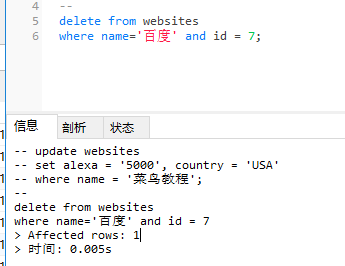

### delete语句

---
#### 1.delete 语句用于删除表中的记录。

```
delete from table_name
where some_column = some_value;
```

*注意：WHERE 子句规定哪条记录或者哪些记录需要删除。如果您省略了 WHERE 子句，所有的记录都将被删除！*

```
delete from websites
where name='百度' and id = 7;
```


---
#### 2.删除所有数据
```
delete from table_name
或者
delete * from table_name
```

*注释：在删除记录时要格外小心！因为您不能重来！*