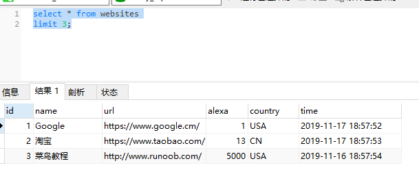

### select top 语句

select top 子句用于规定要返回的记录的*数目*。
select top 子句对于拥有数千条记录的大型表来说，是非常有用的。

*注意:并非所有的数据库系统都支持 select top 语句。 MySQL 支持 limit 语句来选取指定的条数数据， Oracle 可以使用 rownum 来选取。*

limit 英 /ˈlɪmɪt/  美 /ˈlɪmɪt/ n. 限制；限度；界线
vt. 限制；限定 复数 limits过去式 limited现在分词 limiting第三人称单数 limits

percent 英 /pə'sent/  美 /pɚ'sɛnt/ n. 百分比，百分率；部分；百分数  adj. 百分之…的 adv. 以百分之…地 复数 percent


---
#### MySQL limit语法
```
select column_name(s)
from table_name
limit number;


select * from websites
limit 3;
```



---
#### SQL Server / MS Access 语法
```
select top number percent column_name(s)
from table_name
```

从 websites 表中选取前面百分之 50 的记录：
```
select top 50 percent * from websites;
```

---
#### Oracle rownum语法
```
select column_name(s) from table_name
where rownum <= number

select * from websites
where rownum <= 5;
```

