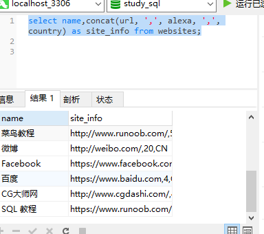
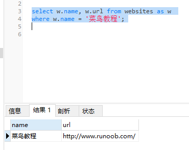

### 别名

通过使用 SQL，可以为*表名称*或*列名称*指定别名。

alias 英 /ˈeɪliəs/  美 /ˈeɪliəs/ adv. （罪犯或演员等）别名，化名；又称，也叫做

site 英 /saɪt/  美 /saɪt/ n. 地点；位置；场所 vt. 设置；为…选址

#### 列的 SQL 别名语法
```MySql
select column_name as alias_name from table_name;
```
我们把三个列（url、alexa 和 country）结合在一起，并创建一个名为 "site_info" 的别名：
```MySql
select name,concat(url, ',', alexa, ',', country) as site_info from websites;
```

concat(url, ',', alexa, ',', country)里的数据会显示在同一列别名中



#### 表的 SQL 别名语法
```MySql
select column_name(s) from table_name as alias_name;
```
我们使用 "Websites"表，为它指定表别名 "w"（通过使用别名让 SQL 更简短）：
```MySql
select w.name, w.url from websites as w 
where w.name = '菜鸟教程';
```



* 不带别名的相同的 SQL 语句：

```MySql
select websites.name,websites.url from websites
where websites.name='菜鸟教程';
```
