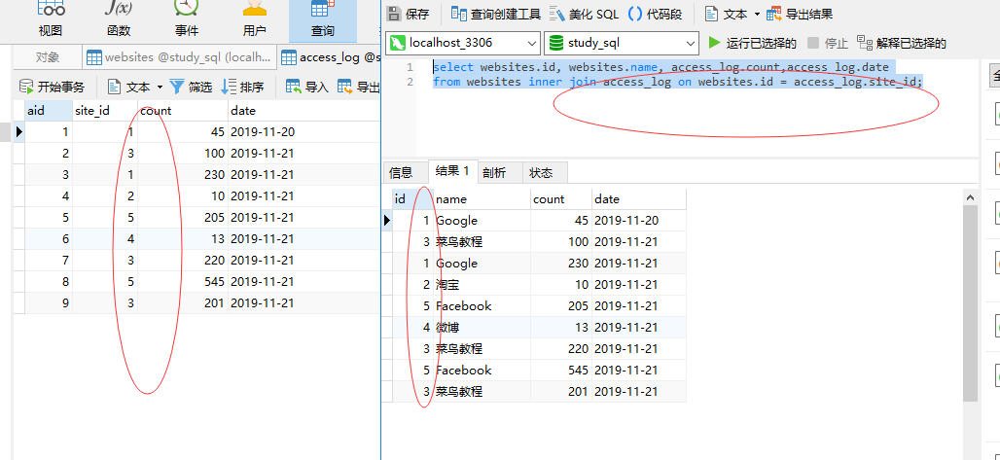

### join连接

* SQL join 用于把来自两个或多个表的行结合起来。

* 下图展示了 inner join、outer join和cross join 相关的 7 种用法。
* 默认inner join
* outer join包含：left join、right join、full join
* 交叉cross join


* left join：即使右表中没有匹配，也从左表返回所有的行
* right join：即使左表中没有匹配，也从右表返回所有的行
* inner join：如果表中有至少一个匹配，则返回行
* full join：只要其中一个表中存在匹配，则返回行

### inner join on实例
inner join：如果表中有至少一个匹配，则返回行,
也就是按照DDL顺序对表AB进行匹配，匹配则返回行。

```
select websites.id, websites.name, access_log.count,access_log.date
from websites inner join access_log on websites.id = access_log.site_id;
```


```
select * from websites 
inner join access_log on websites.id = access_log.site_id;
```


### left join on实例
inner join：即使右表中没有匹配，也从左表返回所有的行,
也就是按照DDL顺序对表AB进行匹配，B表格中没有也从左边返回。
*如果select B表格字段，则只会放回A表格内匹配的所有行*
*所以原则 left join使用 select A from A*
```
select websites.id, websites.name from websites
left join  access_log on websites.id = access_log.site_id; 
```


### right join on实例
right join：即使左表中没有匹配，也从右表返回所有的行，
也就是按照DDL顺序对表AB进行匹配，

*如果select A表格字段，则只会放回B表格内匹配的所有行*
*所以原则 right join使用 select B from B*

```
select access_log.count,access_log.date from access_log
right join websites on access_log.site_id = websites.id;
```


```
select websites.id,websites.name from websites
right join access_log on websites.id = access_log.site_id; 
```


### full join on实例

```
select websites.id,websites.name,access_log.date from websites
full join access_log on websites.id = access_log.site_id;
```
这里要注意的是mysql本身并不支持全连接查询，Oracle数据库支持full join，但是我们可以使用UNION关键字实现

union 联合 n. 联盟，协会；工会；联合  复数 unions

```
select websites.id,websites.name,access_log.count,access_log.date from websites
left join access_log on websites.id = access_log.site_id
union
select websites.id,websites.name,access_log.count,access_log.date from access_log
right join websites on websites.id = access_log.site_id ;
```


### cross join on实例

* 两表直接笛卡尔积的结果数量是两表的数据量相乘（列相加，行相乘）

```
select * from [table 1] cross join [table 2] 或者
select * from [table 1],[table 2]
```

```
select * from websites cross join access_log;
```


* 带where条件id相等的笛卡尔积cross join和inner join结果相同，但是inner join效率快一点
```
select * from websites cross join access_log 
where websites.id = access_log.site_id;
```

