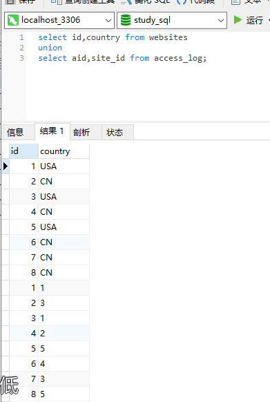
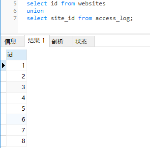
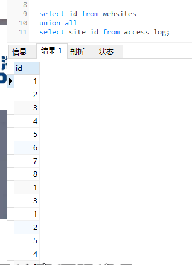
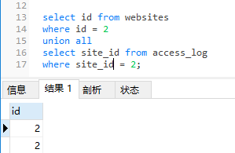

### union 操作符

* union 联合 英 /ˈjuːniən/ n. 联盟，协会；工会；联合  复数 unions

* union操作符合并两个或多个 SELECT 语句的结果。

---
### SQL union 语法
* *请注意，UNION 内部的每个 SELECT 语句必须拥有相同数量的列。列也必须拥有相似的数据类型。同时，每个 SELECT 语句中的列的顺序必须相同。*

```MySql
select column_name(s) from table1
union
select column_name(s) from table2
```
*注释：默认地，UNION 操作符选取不同的值。如果允许重复的值，请使用 UNION ALL。*

#### (1.)查询不同的列
```MySql
select id,country from websites
union
select aid,site_id from access_log;
```


#### (2.)查询相同的列
```MySql
select id from websites
union
select site_id from access_log;
```



---
### SQL union all语法
```MySql
select column(s) from table1
union all
select column(s) from table2
```
*注释：UNION 结果集中的列名总是等于 UNION 中第一个 SELECT 语句中的列名。*

```MySql
select id from websites
union all
select site_id from access_log;
```


---
### 带有 where 的 SQL union all
```MySql
select id from websites
where id = 2
union all
select site_id from access_log
where site_id = 2;
```
