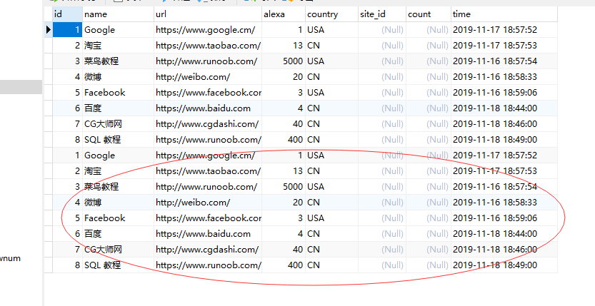

### insert into tableName select tableName

insert into tableName select tableName语句从一个表复制数据，然后把数据插入到一个已存在的表中。

#### 复制所有数据插入，如果两个表结构一样
```
insert into table2
select * from table1;
```
```
insert into websites_copy
select * from websites;
```



#### 复制部分数据插入，如果两个表结构一样
```
insert into table2 (column_name)
select column_name from table1;
```
*注意：只能选择一列数据操作，列明可以任意但必须存在*
```
insert into websites (count)
select (site_id) from access_log;
```

