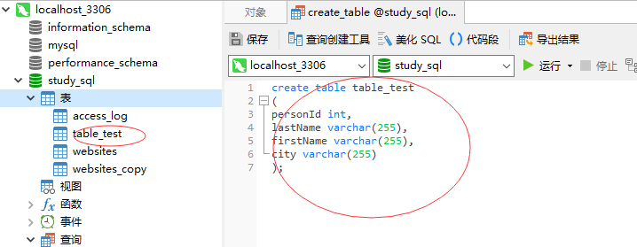

### create table语句

create table 语句用于创建数据库中的表。

表由行和列组成，每个表都必须有个表名。

```MySql
create table table_name 
(
column_name1 data_type(size),
column_name2 data_type(size),
column_name3 data_type(size),
)
```

```MySql
create table table_test
(
personId int,
lastName varchar(255),
firstName varchar(255),
city varchar(255)
);
```


PersonID 列的数据类型是 int，包含整数。

LastName、FirstName、Address 和 City 列的数据类型是 varchar，包含字符，且这些字段的最大长度为 255 个字符。

*提示：可使用 INSERT INTO 语句向空表写入数据。*

varchar 英 /'vɑːkə/  美 /'vɑːkər/ n. 变长字符型；可变长字符串


