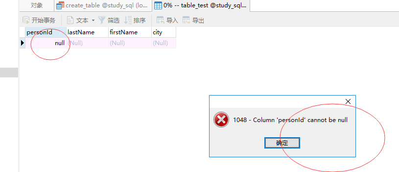
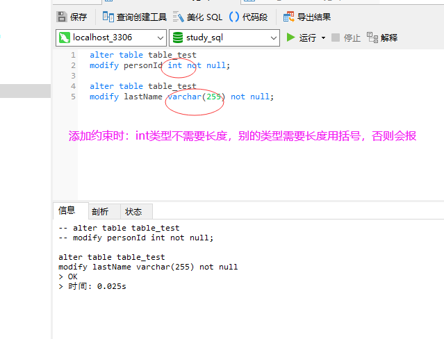
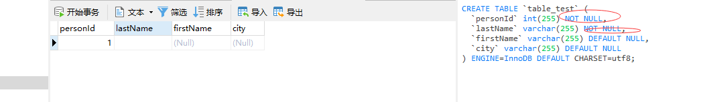
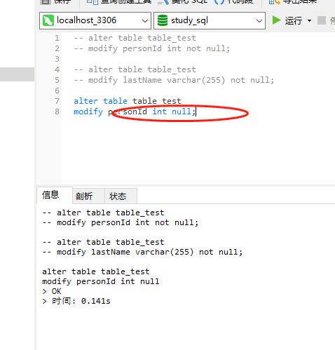
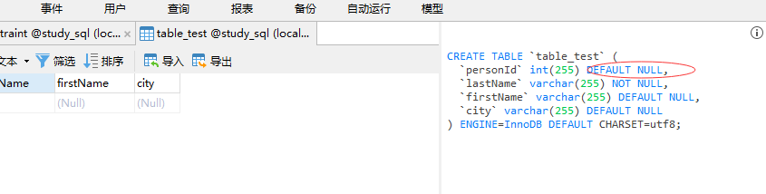
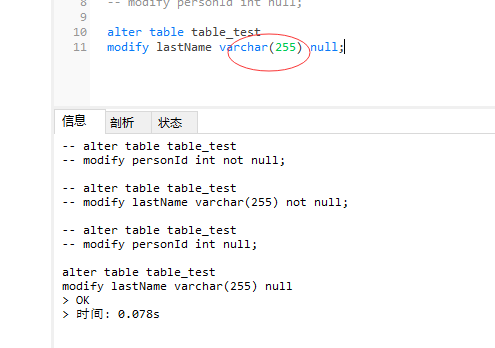
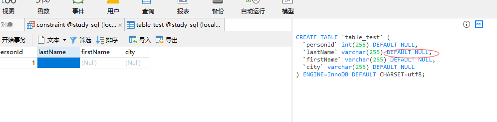

### create table 和 not null约束（Constraints）

constraints 英 /kən'streint/ n. [数] 约束；限制；约束条件（constraint的复数形式）

在默认的情况下，表的列接受 null 值。

not null 约束强制列不接受 null 值。

not null 约束强制字段始终包含值。这意味着，如果不向字段添加值，就无法插入新记录或者更新记录。

下面的 SQL 强制 "personId"、"lastName"、"firstName" 列不接受 NULL 值：

```
create table table_test
(
personId int not null,
lastName varchar(255) not null,
firstName varchar(255) not null,
city varchar(255)
);
```


### 添加 not null 约束

*注意：int字段类型不需要长度，别的类型需要长度使用括号，否则报错*

alter 英 /ˈɔːltə(r)/  美 /'ɔltər/  vt. 改变，更改 vi. 改变；修改
modify 英 /ˈmɒdɪfaɪ/  美 /ˈmɑːdɪfaɪ/ vt. 修改，修饰；更改 vi. 修改
varchar 英 /'vɑːkə/  美 /'vɑːkər/ n. 变长字符型；可变长字符串

在一个已创建的表的 "personId" 字段中添加 not null 约束如下所示：
```
alter table table_test
modify personId int not null;
```



在一个已创建的表的 "lastName" 字段中添加 not null 约束如下所示：
```
alter table table_test
modify lastName varchar(255) not null;
```


### 删除 not null 约束

varchar 英 /'vɑːkə/  美 /'vɑːkər/ n. 变长字符型；可变长字符串

*注意：int字段类型不需要长度，别的类型需要长度使用括号，否则报错*

在一个已创建的表的 "personId" 字段中删除 not null 约束如下所示：
```
alter table table_test
modify personId int null;
```



```
alter table table_test
modify lastName varchar(255) null;
```

