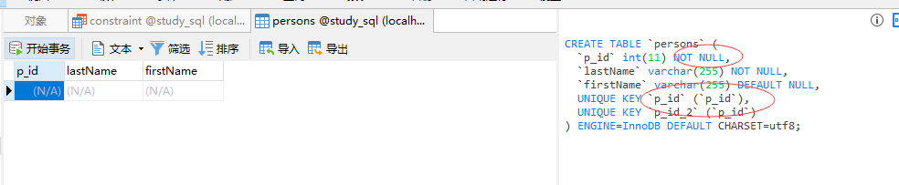
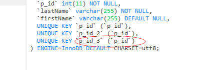
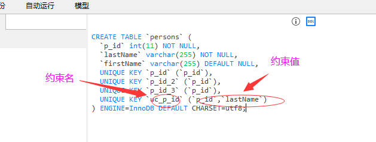
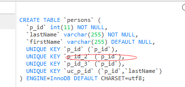
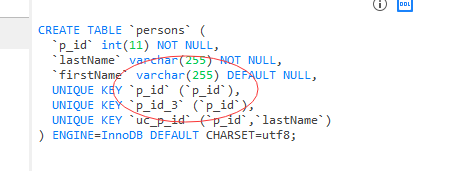

## unique约束

unique 英 /juˈniːk/  美 /juˈniːk/ adj. 独特的，稀罕的；[数] 唯一的，独一无二的 n. 独一无二的人或物

primary  英 /ˈpraɪməri/  美 /ˈpraɪmeri/ adj. 主要的；初级的；基本的 n. 原色；最主要者

unique约束唯一标识数据库表中的每条记录。
unique和primary约束均为列或列集合提供了唯一性的保证。
primary key 约束拥有自动定义的 UNIQUE 约束。

*请注意，每个表可以有多个 unique 约束，但是每个表只能有一个 primary key 约束。*

---
## create table是的 sql unique约束
```MySql
create table persons
(
p_id int not null unique,
lastName varchar(255) not null,
firstName varchar(255),
unique (p_id)
)
```


---
## alter table时的sql unique约束
alter 英 /ˈɔːltə(r)/  美 /'ɔltər/  vt. 改变，更改 vi. 改变；修改

* 修改字段unique

```MySql
alter table persons
add unique (p_id)
```


*注：添加几次unique就会在DDL里面有几次unique key值,并且unique 约束名 约束值*

* 如需命名 unique 约束，并定义多个列的 unique 约束，请使用下面的 SQL 语法：
MySQL / SQL Server / Oracle / MS Access：
```MySql
alter table persons
add constraint uc_p_id unique (p_id, lastName);
```

*注：uc_p_id是约束名字，(p_id, lastName)是约束值*


---
## 撤销unique约束

drop 英 /drɒp/  美 /drɑːp/ v. 推动；帮助；宣扬；下降；终止 n. 滴；落下；空投；微量；滴剂 
过去式 dropped或dropt过去分词 dropped或dropt现在分词 dropping第三人称单数 drops
drop index 删除索引

* MySQL：

```MySql
alter table persons
drop index p_id_2;
```



* SQL Server / Oracle / MS Access：

```MySql
alter table persons
drop constraint p_id_2;
```
