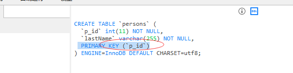
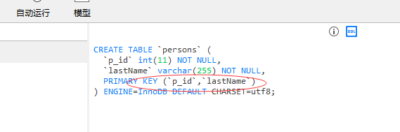
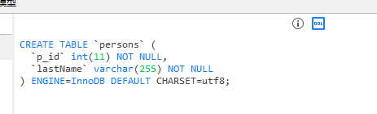

### primary key 约束 (主键约束)

primary  英 /ˈpraɪməri/  美 /ˈpraɪmeri/ adj. 主要的；初级的；基本的 n. 原色；最主要者

primary key 主键

primary key 约束唯一标识数据库表中的每条记录。
主键必须包含唯一的值。
主键列不能包含 NULL 值。
每个表都应该有一个主键，并且每个表只能有一个主键。

### create table 时的 sql primary key 约束

* MySQL：
```
create table persons
(
p_id int not null,
lastName varchar(255) not null,
primary key (p_id)
);
```


* SQL Server / Oracle / MS Access：
```
create table persons
(
p_id int not null primary key,
lastName varchar(255) not null
)
```

* 定义多个列的 primary key 约束
MySQL / SQL Server / Oracle / MS Access：
```
create table persons
(
p_id int not null,
lastName varchar(255) not null,
constraint pk_p_id primary key (p_id, lastName)
);
```
*注意：pk_p_id是primary key的名字，但是primary key是惟一的，所以DDL里没有名字*



### alter table 时的sql primary key约束

* MySQL / SQL Server / Oracle / MS Access：
```
alter table persons
add primary key (p_id) 
```

* 定义多个列的 primary key 约束
```
alter table persons
add constraint pk_p_id primary key (p_id, lastName);
```

### 撤销 primary key约束

* MySQL：
```
alter table persons
drop primary key;
```


* SQL Server / Oracle / MS Access：
```
alter table persons
drop constraint pk_p_id;
-- 运行失败 primary key没有名字
```
*注意：pk_p_id是primary key的名字，但是primary key是惟一的，所以DDL里没有名字*