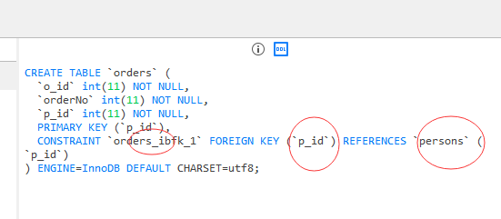
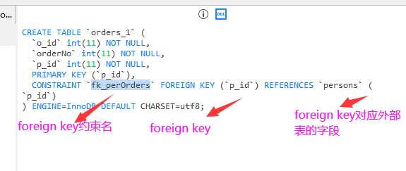
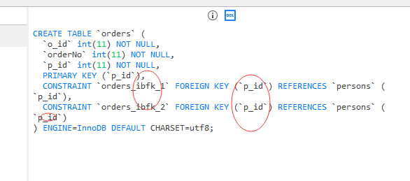
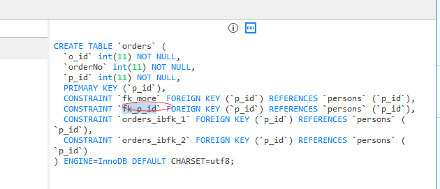

## foreign key 约束

foreign 英 /ˈfɒrən/  美 /ˈfɔːrən/ adj. 外国的；外交的；异质的；不相关的

一个表中的 foreign key 指向另一个表中的 unique key(唯一约束的键)。

foreign key 约束用于预防破坏表之间连接的行为。

foreign key 约束也能防止非法数据插入外键列，因为它必须是它指向的那个表中的值之一。

---
## create table时的SQL foreign key约束

orders 英 /'ɔːdərs/  美 /'ɔrdərs/ abbr. 圣职 (holy orders) n. 顺序；订单；命令；决议；整齐；勋章（order 的复数） v. 点（餐）；订购；命令；调整（order 的第三人称单数）

### 1.创建'orders'表，在'p_id'列上创建foreign key约束：
MySQL：
```MySql
create table orders
(
o_id int not null,
orderNo int not null,
p_id int,
primary key (p_id),
foreign key (p_id) references persons(p_id)
)
```


references 参考 英 /'refərənsɪz/  美 /'rɛfərənsɪz/ n. [图情] 参考文献；参照；推荐信（reference的复数） v. 附…以供参考；把…引作参考（reference的三单形式）

如果persons表不存在，先创建
```MySql
create table persons
(
p_id int not null,
lastName carchar(255) not null,
primary key (p_id)
);
```

SQL Server / Oracle / MS Access：
```MySql
create table orders
(
o_id int not null primary key,
orderNo int not null,
p_id int foreign key references persons(p_id)
)
```


### 2.定义多个列的 foreign key 约束
```MySql
create table orders_1
(
o_id int not null,
orderNo int not null,
p_id int,
primary key (p_id),
constraint fk_perOrders foreign key (p_id) references persons(p_id)
)
```


---
## alter table 时的 SQL foreign key约束

### 1.修改单列foreign key
MySQL / SQL Server / Oracle / MS Access：
```MySql
alter table orders
add foreign key (p_id) references persons(p_id)
```


*注意：foreign key 不是只能唯一的，所以连续修改会存在多个*

### 2.修改多列foreign key
MySQL / SQL Server / Oracle / MS Access：
```MySql
alter table orders
add constraint fk_p_id foreign key (p_id) references persons(p_id)
```



---
## 撤销 foreign key 约束

MySQL：
```MySql
alter table orders
drop foreign key fk_more
```

SQL Server / Oracle / MS Access：
```MySql
alter table orders
drop constraint fk_more
```
