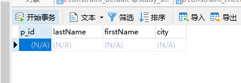

### check 约束

check 英 /tʃek/  美 /tʃek/ vt. 检查，核对；制止，抑制；在…上打勾；托运 vi. 核实，查核；中止；打勾；[象棋]将一军 n. <美>支票；制止，抑制；检验，核对

check 约束用于限制列中的值的范围。

如果对单个列定义 check 约束，那么该列只允许特定的值。

如果对一个表定义 check 约束，那么此约束会基于行中其他列的值在特定的列中对值进行限制。

---
### create table 时的SQL check 约束

#### 单列约束
创建表'persons', 在'p_id'列创建check约束：check约束规定'p_id'列必须只包含大于0的整数。
MySQL：
```MySql
create table persons
(
p_id int not null,
lastName varchar(255) not null,
firstName varchar(255),
city varchar(255),
check (p_id > 10)
)
```


#### 多列约束
MySQL / SQL Server / Oracle / MS Access：
```MySql
create table persons_1
(
p_id int not null,
lastName varchar(255) not null,
firstName varchar(255),
city varchar(255),
constraint chk_person check (p_id > 10 and city = 'Sandnes')
)
```

---
### alter table 时的 SQL check 约束

#### 单列约束
MySQL / SQL Server / Oracle / MS Access:
```MySql
alter table persons
add check (p_id > 10)
```

#### 多列约束
MySQL / SQL Server / Oracle / MS Access：
```MySql
alter table persons
add constraint chk_person check (p_id > 10 and city='Sandnes')
```

---
### 撤销 check 约束
MySQL：
```MySql
alter table persons
drop check chk_person
```

SQL Server / Oracle / MS Access：
```
alter table persons
drop constraint chk_person
```