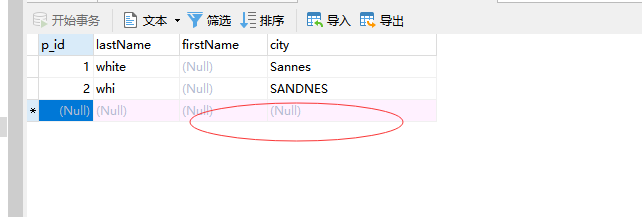

### default 约束

default 约束用于向列中插入默认值。
如果没有规定其他的值，那么会将默认值添加到所有的新记录。

### create table时的 SQL default 约束

（1）、My SQL / SQL Server / Oracle / MS Access：
```
create table persons
(
p_id int not null,
lastName varchar(255) not null,
firstName varchar(255),
city varchar(255) default 'Sannes'
)
```
执行sql语句后此时是没有记录的

点击添加记录插入一条值后'city'会有一个默认值


<br />
（2）、通过使用类似 getDate() 这样的函数，default 约束也可以用于插入系统值：

*注意：sql server 才支持getDate()*
sql支持：
获得当前 UTC 日期时间函数：
> 
utc_date()：返回当前UTC日期作为'YYYY-MM-DD“或YYYYMMDD格式的值， 根据该函数是否用在字符串或数字语境中。
utc_time()：返回当前UTC时间在“HH：MM：SS'或HHMMSS格式的值， 根据函数是否用在字符串或数字语境中。
utc_timestamp()：返回当前UTC日期和时间作为'YYYY-MM-DD HH:MM:SS'或YYYYMMDDHHMMSS格式的一个值，根据函数是否用在字符串或数字语境中。
current_date(): 当前日期
current_time(): 当前时间
current_timestemp(): 当前日期时间
```
create table orders
(
o_id int not null,
orderNo int not null,
p_id int,
orderDate datetime  default  current_timestamp()
)
``` 
*注：'orderDate'字段只能是'datetime', 时间方法是'current_timestamp()'才能创建成功*
*别的类型和方法都报错*
点击添加记录后


### alter table 时的 SQL default 约束

* MySQL：
```
alter table persons
alter city set default 'SANDNES'
```


* SQL Server / MS Access：
```
alter persons
add constraint ab_c default 'SANDNES' for city
```
* Oracle：
```
alter table persons
modify city 'SANDNES'
```

### 撤销 default 约束
MySQL：
```
alter table persons
alter city drop default
```


SQL Server / Oracle / MS Access：
```
alter table persons
alter column city srop default
```