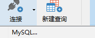
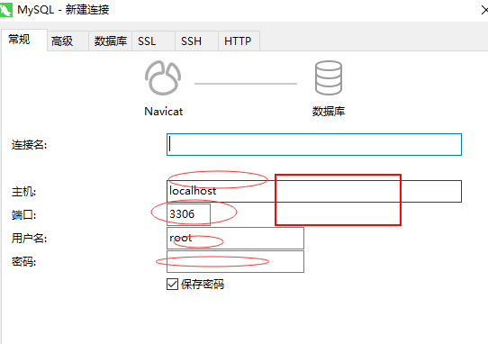
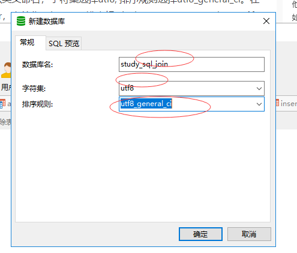
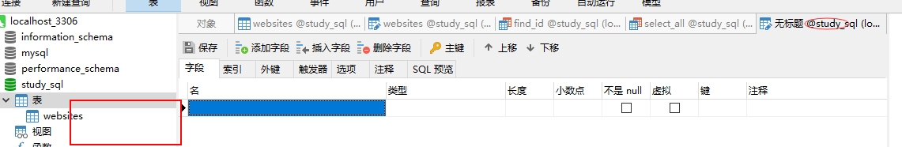
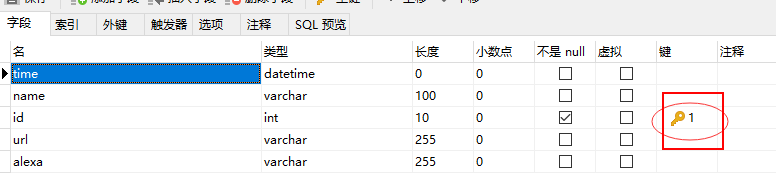
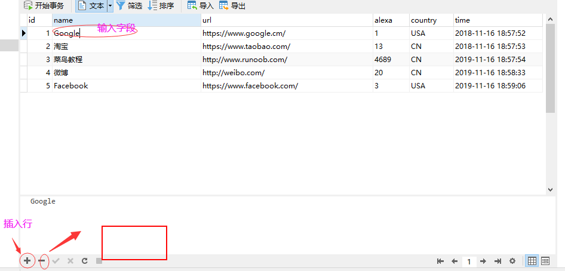
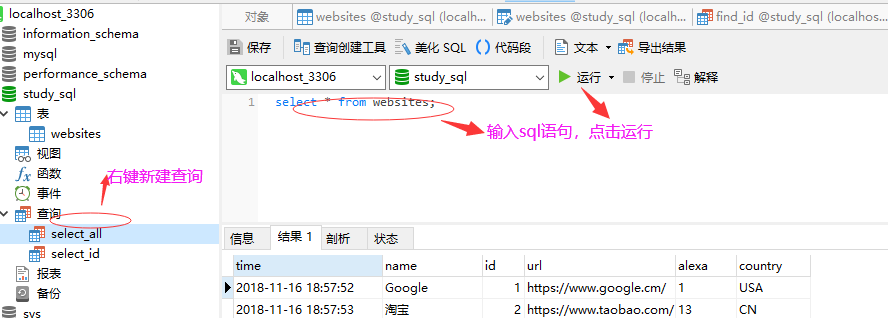
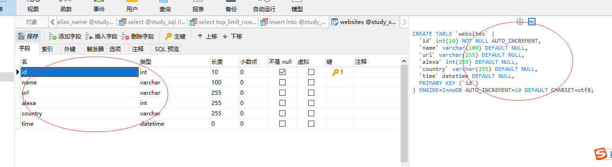

### navicat使用方法

(1.)连接数据库

(2.)右键创建表, 选择字符集合排序规则

general 英 /ˈdʒenrəl/  美 /ˈdʒenrəl/ adj. 一般的，普通的；综合的；大体的
n. 一般；将军，上将；常规

(3.)创建字段

(4.)修改字段、插入行

(5.)使用上移下移来排序，保存会自动更新DDl(建表语句)

### 创建数据库表

表名字： websites

表数据： 

| id | name | url | alexa | country |
| -::- | -::- | -::- | -::- | -::- |
| Google | https://www.google.cm/  | 1 | USA |
| 淘宝 | https://www.taobao.com/  | 13  | CN |
| 菜鸟教程 | http://www.runoob.com/  | 4689 | CN |
| 微博  | http://weibo.com/   | 20 | CN |
| Facebook | https://www.facebook.com/  | 3 | USA |