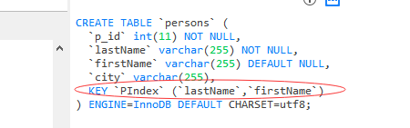
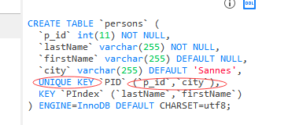

### create index 语句

create index 语句用于在表中创建索引。

在不读取整个表的情况下，索引使数据库应用程序可以更快地查找数据。

创建表：
```
create table persons
(
p_id int not null,
lastName varchar(255) not null,
firstName varchar(255),
city varchar(255) default 'Sannes'
)
```

### 索引

您可以在表中创建索引，以便更加快速高效地查询数据。

用户无法看到索引，它们只能被用来加速搜索/查询。

注释：更新一个包含索引的表需要比更新一个没有索引的表花费更多的时间，这是由于索引本身也需要更新。因此，理想的做法是仅仅在常常被搜索的列（以及表）上面创建索引。

#### SQL create index 创建索引
```
create index index_name
on table_name (column_name)
```
```
create index PIndex
on persons (lastName, firstName)
```


#### SQL create unique index 创建唯一索引

在表上创建一个唯一的索引。不允许使用重复的值：唯一的索引意味着两个行不能拥有相同的索引值。
```
create unique index index_name
on table_name (column_name)
```
```
create unique index PID
on persons (p_id, city)
```



### 删除索引(索引和唯一索引)
```
drop index index_name on table_name
|
alter table table_name drop index index_name
```
```
drop index city on persons
|
alter table persons drop index PID_1
```


### 修改索引

先删除在创建