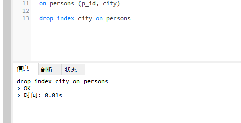

### SQL撤销索引、撤销表以及撤销数据库

通过使用 DROP 语句，可以轻松地删除索引、表和数据库。

### drop index语句
用于 MySQL 的drop index 语法：
```
drop index index_name on table_name
|
alter table table_name drop index index_name
```
```
drop index city on persons
|
alter table persons drop index PID_1
```


### drop table语句

drop table 语句用于删除表。
```
drop table test
```

### drop database语句
drop datebase 语句用于删除数据库。
```
drop database database_name
```

### truncate table语句

仅仅需要删除表内的数据，但并不删除表本身

truncate 截断 截取 英 /trʌŋˈkeɪt/  美 /ˈtrʌŋkeɪt/ v. 截断，删节；把……截成平面 adj. （叶、羽毛等）截形的；截短的
```
truncate table table_name
```
