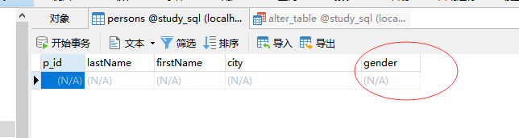
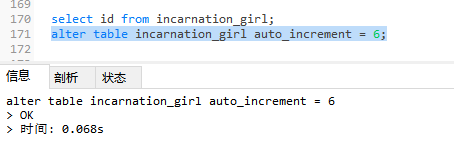

## alter table语句

alter table 语句用于在已有的表中添加、删除或修改列。

---
## 在表中添加列
```MySql
alter table table_name
add column_name datatype
```

```MySql
alter table persons
add gender varchar(255)
```
*注：datatype需要数据类型*


---
## 删除表中的列
```MySql
alter table table_name
drop column_name datatype
```

```MySql
alter table persons
drop column gender
```

---
## 改变表中列的数据类型
My SQL / Oracle：
```MySql
alter table table_name
modify column column_name datatype
```

```MySql
alter table persons
modify column gender int
```
注意类型后面要加长度
```MySql
alter table persons
modify column gender varchar(255)
```

---
## 获取自增id的方法

```MySql
select max(id) from tableName;  # 很多客户端使用时候都会被查询到
# 或者
select last_insert_id() from tableName; # 保证只查询自己客户端的活动，而且不需要加锁。
```

---
## 修改表的主键自增开始值

* 若没有主键

```MySql
select id from tableName;
alter table tableName
primary key (id);
```

* 若有主键

increment 英 /ˈɪŋkrəmənt/  美 /ˈɪŋkrəmənt/ n. [数] 增量；增加；增额；盈余 复数 increments
auto increment 自动递增

```MySql
select id from tableName;
alter table tableName auto_increment = 10;
```


