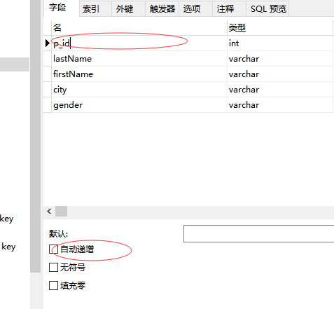
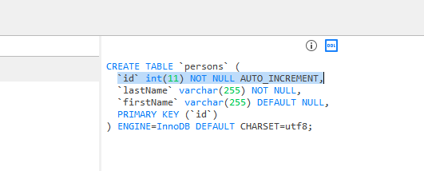
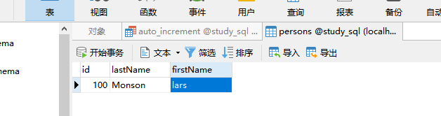

## SQL auto increment 字段

increment 增量 定期增加 英 /ˈɪŋkrəmənt/  美 /ˈɪŋkrəmənt/  n. [数] 增量；增加；增额；盈余
复数 increments

我们通常希望在每次插入新记录时，自动地创建主键字段的值。

我们可以在表中创建一个 auto-increment(自增)字段。



---
## 用于 MySQL 的语法

### 1.create table和auto_increment
把 "persons" 表中的 "id" 列定义为 auto-increment 主键字段：
```MySql
create table persons
(
id int not null auto_increment,
lastName varchar(255) not null,
firstName varchar(255),
primary key (id)
)
```


默认地，auto_increment 的开始值是 1，每条新记录递增 1。

### 2.修改auto_increment的起始值
```MySql
alter table persons auto_increment=100
```

### 3.修改auto_increment后插入记录
```MySql
insert into persons
(firstName, lastName) values ('lars', 'Monson')
```



---
## 用于 MySQL Server的语法
```MySql
create table persons
(
id int identity(1,1) primary key,
lastName varchar(255) not null,
firstName varchar(255),
address varchar(255),
city varchar(255)
)
```

identity 英 /aɪˈdentəti/  美 /aɪˈdentəti/  n. 身份；同一性，一致；特性；恒等式

---
## 用于 Access的语法
```MySql
create table persons
(
id Integer primary key autoincrement,
lastName varchar(255) NOT NULL,
firstName varchar(255),
address varchar(255),
city varchar(255)
)
```
