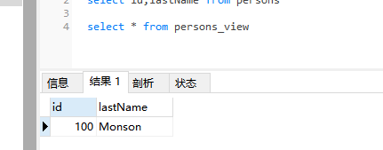

## 视图

视图是可视化的表。

视图包含行和列，就像一个真实的表。视图中的字段就是来自一个或多个数据库中的真实的表中的字段。

您可以向视图添加 SQL 函数、WHERE 以及 JOIN 语句，也可以呈现数据，就像这些数据来自于某个单一的表一样。

---
## SQL create view 创建视图语法

condition 英 /kənˈdɪʃn/  美 /kənˈdɪʃn/ n. 条件；情况；环境；身份 vt. 决定；使适应；使健康；以…为条件

```MySql
create view view_name 
as
select columns from table_name where condition
```
注释：视图总是显示最新的数据！每当用户查询视图时，数据库引擎通过使用视图的 SQL 语句重建数据。

```MySql
create view persons_view 
as
select id,lastName from persons where id=100
```


---
## 查询视图
```MySql
select * from view_name
```


---
## 更新视图
```MySql
create or replace view view_name as
select columns from table_name where condition
```

```MySql
create or replace view persons_view 
as
select id,lastName,firstName from persons where id=100
```


---
## 撤销视图
```MySql
drop view view_name
```
