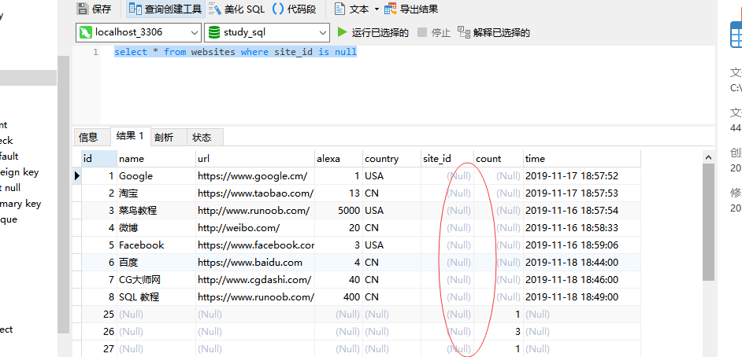
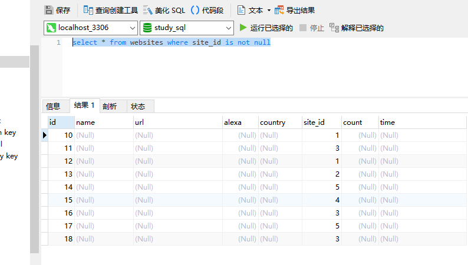

### SQL null 值

NULL 值代表遗漏的未知数据。

默认地，表的列可以存放 NULL 值。

如果表中的某个列是可选的，那么我们可以在不向该列添加值的情况下插入新记录或更新已有的记录。这意味着该字段将以 NULL 值保存。

NULL 值的处理方式与其他值不同。

NULL 用作未知的或不适用的值的占位符。

Note注释：无法比较 NULL 和 0；它们是不等价的。

### SQL 的 null 值处理和使用

无法使用比较运算符来测试 NULL 值，比如 =、< 或 <>。

我们必须使用 is null 和 in not null 操作符。

```
select * from websites where site_id is null
```


```
select * from websites where site_id is not null
```



### SQL isnull()、nvl()、ifnull()、coalesce()函数

coalesce 英 /ˌkəʊəˈles/  美 /ˌkoʊəˈles/ vi. 合并；结合；联合 vt. 使…联合；使…合并  过去式 coalesced过去分词 coalesced现在分词 coalescing第三人称单数

nvl 以一个值来替换空值

#### SQL isnull(field)
```
select isnull(name) from websites where id=1
```
结果：0（0代表false，1代表true）

#### oracle nvl(field, 0)
```
select nvl(name, 0) from websites where id=1
````

#### SQL ifnull(field, 0)
```
select ifnull(name, 0) from websites where id=1
```
结果：Google（name不为空）

```
select ifnull(site_id, 0) from websites where id=1
```
结果：0 （site_id是null值，所以以0代替）

#### SQL coalesce(field, 0)
```
select coalesce(site_id, 0) from websites where id=1
```
结果：0（site_id是null值，所以以0代替）

```
select coalesce(name, 0) from websites where id=1
```
结果：Google（name不是null值，返回name值）


