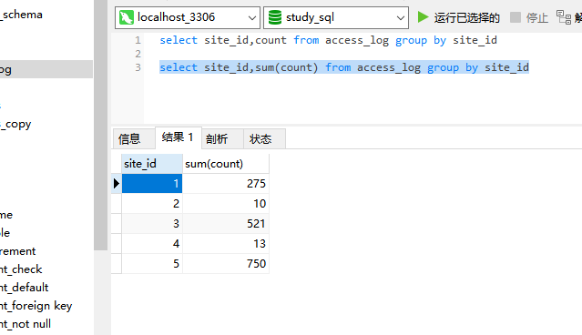
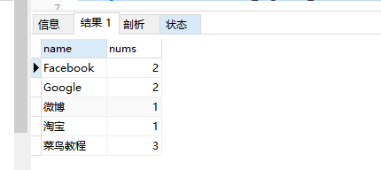

## group by语句

group by 语句用于结合聚合函数，根据一个或多个列对结果集进行*分组*。

```MySql
select column_name,aggregate_function(column_name) from table_name
where column_name operator value
group by column_name
```

---
## 查询实例
aggregate 英 /ˈæɡrɪɡət/  美 /ˈæɡrɪɡət/ n. 合计；集合体；总计；集料 adj. 聚合的；集合的；合计的 v. 集合；聚集；合计
operator 英 /ˈɒpəreɪtə(r)/  美 /ˈɑːpəreɪtər/ 经营者；操作员；运营商；话务员；行家

数据结构：


统计 access_log 各个 site_id 的访问量：
```MySql
select site_id,sum(count) from access_log group by site_id
```



---
## 多表连接

表结构：


下面的 SQL 语句统计有记录的网站的记录数量：

```MySql
select websites.name,count(access_log.aid) as nums from access_log
left join websites on access_log.site_id=websites.id group by websites.name
```

