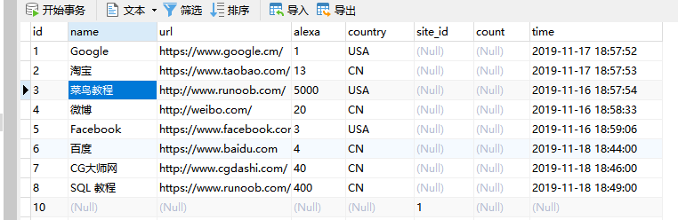
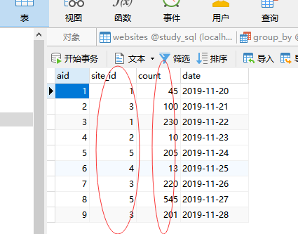
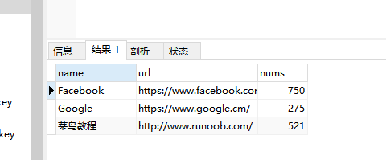
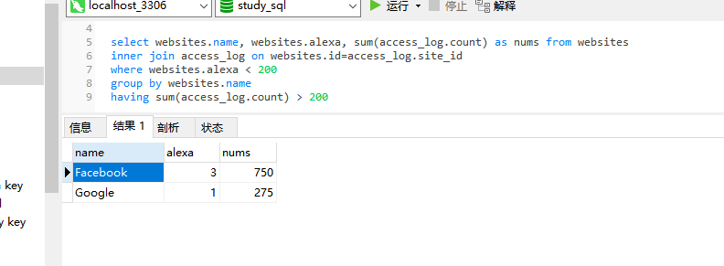

### having子句

在 SQL 中增加 having 子句原因是，where 关键字无法与聚合函数一起使用。

having 子句可以让我们筛选分组后的各组数据。

```
select column_name,aggregate_function(column_name) from table_name
where column_name operator value
group by column_name
having aggregate_function(column_name) operator value
```

aggregate 英 /ˈæɡrɪɡət/  美 /ˈæɡrɪɡət/ n. 合计；集合体；总计；集料 adj. 聚合的；集合的；合计的 v. 集合；聚集；合计
operator 英 /ˈɒpəreɪtə(r)/  美 /ˈɑːpəreɪtər/ 经营者；操作员；运营商；话务员；行家

---
表结构：




现在我们想要查找总访问量大于 200 的网站。

```
select websites.name,websites.url,sum(access_log.count) as nums from access_log
inner join websites on access_log.site_id=websites.id group by websites.name
having sum(access_log.count) > 200
```



---
现在我们想要查找总访问量大于 200 的网站，并且 alexa 排名小于 200。
```
select websites.name, websites.alexa, sum(access_log.count) as nums from websites
inner join access_log on websites.id=access_log.site_id
where websites.alexa < 200
group by websites.name
having sum(access_log.count) > 200
```


