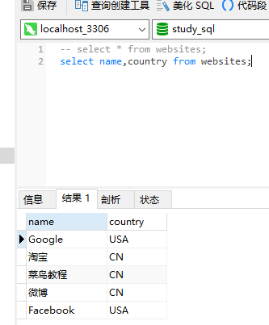
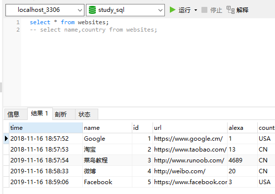

### select语法

SELECT 语句用于从数据库中选取数据。
结果被存储在一个结果表中，称为结果集。

#### 语法1
```MySql
select column_name,column_name from table_name
```

```MySql
select name,country from websites;
```


#### 语法2
```MySql
select * from table_name
```

