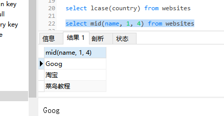

###  SQL mid()

mid()函数用于从文本字段中提取字符。

```
select mid(column_name, start[,length]) from table_name
```

| 参数 | 描述 |
| -:- | -:- |
| column_name | 必需。要提取字符的字段。 |
| start | 必需。规定开始位置（起始值是 1）。 |
| length | 可选。要返回的字符数。如果省略，则 MID() 函数返回剩余文本。 |

```
select mid(name, 1, 4) from websites
```
