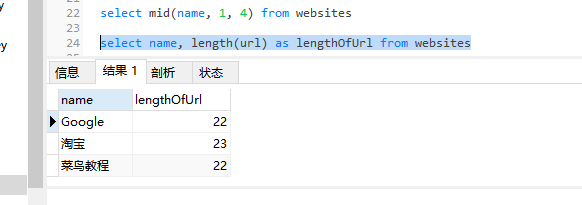

### SQL len()函数

len()函数返回文本字段中值的长度。

SQL len() 语法
```MySql
select len(column_name) from table_name
```

MySQL length() 语法
```MySql
select length(column_name) from table_name
```

MySql实例
```MySql
select name, length(url) as lengthOfUrl from websites
```

