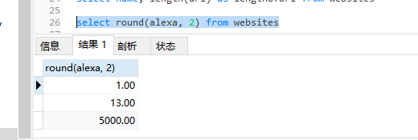

### round()

round 英 /raʊnd/  美 /raʊnd/ adj. 圆的；弧形的；整数的；完全的；大概的；肥胖的；（声音）圆润的；（古，钱）大量的；（古，人或其说话方式）耿直的
adv. 旋转；周围；围绕；到处；迂回地；朝反方向；挨个；到某处 prep. 围绕；绕过；大约；在……周围；在……各处 n. 阶段；轮次；回合；常规活动；圆，圆形物；循环；固定路线 v. （使）变圆；完成；四舍五入；围捕；绕行；进展；环行；发胖

```
select round(column_name, decimals) from table_name
```

decimals 美 /'dɛsɪml/ n. [数] 小数（decimal的复数形式）；位数

| 参数 | 描述 |
| -:- | -:- |
| column_name | 必需。要舍入的字段。 |
| decimsls | 必需。规定要返回的小数位数。 |

```
select round(alexa, 2) from websites
```
