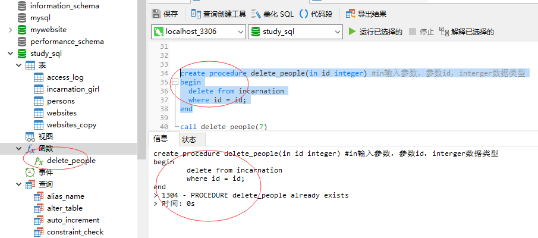
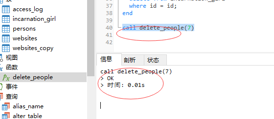
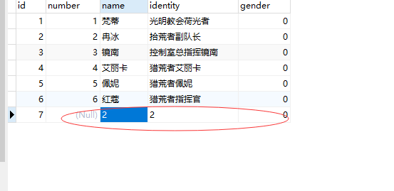
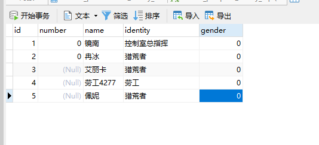
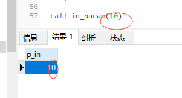
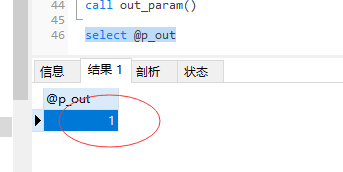
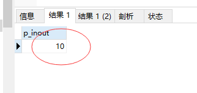
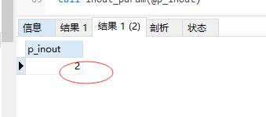
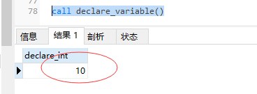

## MySQL 存储过程

存储过程（Stored Procedure）是一种在数据库中存储复杂程序，以便外部程序调用的一种数据库对象。

Stored 英 /stɔ:(r)d/  美 /stɔ(r)d/ v. 储存；容纳（store 的过去式和过去分词）
Procedure 英 /prəˈsiːdʒə(r)/  美 /prəˈsiːdʒər/ n. 程序，手续；步骤 复数 procedures

存储过程是为了完成特定功能的SQL语句集，经编译创建并保存在数据库中，用户可通过指定存储过程的名字并给定参数(需要时)来调用执行。

存储过程思想上很简单，就是数据库 SQL 语言层面的代码封装与重用。

优点
> 
存储过程可封装，并隐藏复杂的商业逻辑。
存储过程可以回传值，并可以接受参数。
存储过程无法使用 SELECT 指令来运行，因为它是子程序，与查看表，数据表或用户定义函数不同。
存储过程可以用在数据检验，强制实行商业逻辑等。


缺点
> 
存储过程，往往定制化于特定的数据库上，因为支持的编程语言不同。当切换到其他厂商的数据库系统时，需要重写原有的存储过程。
存储过程的性能调校与撰写，受限于各种数据库系统。

## 一、存储过程的创建和调用

* 存储过程就是具有名字的一段代码，用来完成一个特定的功能。
* 创建的存储过程保存在数据库的数据字典中。

## 创建存储过程
```MySql
# 创建mysql存储过程(存储函数)：create procedure 存储过程名(参数)
create procedure sp_name ([in | out |inout] l_int type) 
	# 存储过程开始和结束符号：begin ... end
	begin [开始标签：]
		[statement_list 声明列表]
		...
	end [结束标签]

```

procedure 程序 过程 英 /prəˈsiːdʒə(r)/  美 /prəˈsiːdʒər/ n. 程序，手续；步骤 复数 procedures
statement 声明 英 /ˈsteɪtmənt/  美 /ˈsteɪtmənt/ n. 声明；陈述，叙述；报表，清单 复数 statements过去式 statemented过去分词statemented现在分词


## MYSQL 存储过程中的关键语法

1.变量定义:
```MySql
declare l_int int unsigned default 4000000;
```
declare 声明 英 /dɪˈkleə(r)/  美 /dɪˈkler/ vt. 宣布，声明；断言，宣称 vi. 声明，宣布 过去式 declared过去分词 declared现在分词 declaring第三人称单数 declares
unsigned 无符号的 英 /ʌn'saɪnd/  美 /ʌn'saɪnd/ adj. 无符号的；未签名的

2.变量赋值:
```MySql
set @l_int = 1
```

3.创建mysql存储过程(存储函数):
```MySql
create procedure 存储过程名(参数)
# 例如：用上面变量声明存储过程(存储函数)
create procedure demo_in_l_int(in l_int int)
```
procedure 程序 过程 英 /prəˈsiːdʒə(r)/  美 /prəˈsiːdʒər/ n. 程序，手续；步骤 复数 procedures


4.存储过程体:
```MySql
create function 存储函数名(参数)
```

5.存储过程开始和结束符号:
```MySql
begin ... end; # ;号结束符是必须的
```

6.声明语句结束符，可以自定义:
```MySql
definer $$
或
delimiter //
```
define 英 /dɪˈfaɪn/  美 /dɪˈfaɪn/ vt. 定义；使明确；规定 过去式 defined过去分词 defined现在分词 defining第三人称单数 defines
definer 定义者 n. 定义者（define的名词形式）
delimiter 定界符 英 /dɪ'lɪmɪtə/  美 /dɪ'lɪmɪtɚ/ n. [计] 定界符


## 实例
* 创建数据库，备份数据表用于示例操作：

```MySql
-- 创建表格
create table incarnation
(
id int not null auto_increment primary key,
number integer(255),
name varchar(255)
)
```

tennis 英 /ˈtenɪs/  美 /ˈtenɪs/ n. 网球（运动）
matches  英 /'mætʃɪz/  美 /'mætʃɪz/ n. 比赛（match的复数）；火柴 v. 匹配（match的第三人称单数形式）；匹敌
match 英 /mætʃ/  美 /mætʃ/ n. 火柴；比赛，竞赛；对手；相配的人（或物）；（计算机）匹配；配合；搭配；相似的东西；婚姻；配偶
v. 相配，相称；相似；与……成对；配对；敌得过，比得上；使等同于；使……对应；满足；与……竞争；结婚  第三人称单数 matches过去式 matched过去分词 matched现在分词 matching复数 matches
team 英 /tiːm/  美 /tiːm/ n. 队；组 vt. 使合作 vi. 合作 复数 teams过去式 teamed过去分词 teamed现在分词 teaming第三人称单数 teams
won 英 /wʌn/  美 /wʌn/  vt. 赢得（win的过去式和过去分词）
lost 英 /lɒst/  美 /lɔːst/  adj. 迷路的，迷失的；失去的，丧失的；无法恢复的；迷惘的，丧失信心的；处于困境的；逝去的；死亡的；失败的 v. 失去；遗失；痛失；流产；牺牲；失败（lose 的过去式和过去分词）

```MySql
create procedure delete_people(in delete_id integer) #in输入参数，参数id，interger数据类型
begin
	delete from incarnation
	# where id = id; # 注意 id = id 会删除所有数据，所以定义参数不能命名为id，不能和字段名一样
	where id = delete_id;  # ;号结束符是必须的
end; # ;号结束符是必须的
```


matches 英 /'mætʃɪz/  美 /'mætʃɪz/  n. 比赛（match的复数）；火柴 v. 匹配（match的第三人称单数形式）；匹敌
integer 英 /ˈɪntɪdʒə(r)/  美 /ˈɪntɪdʒər/ n. 整数
integer(p) -> 整数值（没有小数点）。精度 10。
drop 英 /drɒp/  美 /drɑːp/ v. 推动；帮助；宣扬；下降；终止 n. 滴；落下；空投；微量；滴剂
exists 英 /ɪɡˈzɪsts/  美 /ɪɡˈzɪsts/ n. 存在量词（exist的复数） v. 存在；出现；活着（exist的三单形式）

解析：默认情况下，存储过程和默认数据库相关联，如果想指定存储过程创建在某个特定的数据库下，那么在过程名前面加数据库名做前缀。 在定义过程时，使用 DELIMITER $$ 命令将语句的结束符号从分号 ; 临时改为两个 $$，使得过程体中使用的分号被直接传递到服务器，而不会被客户端（如mysql）解释。

调用存储过程：

```MySql
call delete_people(7)
```





## 存储过程体

* 存储过程体包含了在过程调用时必须执行的语句，例如：dml、ddl语句，if-then-else和while-do语句、声明变量的declare语句等
* 过程体格式：以begin开始，以end结束(可嵌套)

```MySql
begin
	begin
		statemnet声明;
	end;
end;
```

注意：每个嵌套块及其中的每条语句，必须以分号结束，表示过程体结束的begin-end块(又叫做复合语句compound statement)，则不需要分号。
为语句块贴标签:
```MySql
[begin_label:] BEGIN
　　[statement_list]
END [end_label];
```

```MySql
label1: BEGIN
　　label2: BEGIN
　　　　label3: BEGIN
　　　　　　statements; 
　　　　END label3 ;
　　END label2;
END label1;
```

标签有两个作用：
* 
1、增强代码的可读性
2、在某些语句(例如:leave和iterate语句)，需要用到标签


## 存储过程的参数

MySQL存储过程的参数用在存储过程的定义，共有三种参数类型,IN,OUT,INOUT

```MySql
create procedure 存储过程名([[IN |OUT |INOUT ] 参数名 数据类形...])
```

in 输入参数：表示调用者向过程传入值（传入值可以是字面量或变量）

out 输出参数：表示过程向调用者传出值(可以返回多个值)（传出值只能是变量）

inout 输入输出参数：既表示调用者向过程传入值，又表示过程向调用者传出值（值只能是变量）


* in 

```MySql
create procedure in_param(in p_in int)
begin
	select p_in;  # 用select返回一个结果
end;

call in_param(10)
```



* out

```MySql
create procedure out_param(out p_out int)
begin
  set p_out=1;
  select p_out; # ;号结束符是必须的 # 用select返回一个结果
end;
```

```MySql
call out_param()
select @p_out # 1  # 用select返回一个结果
```


out是输出参数，给定函数一个参数是无效的
```MySql
set @p_out = 3
call out_param(@p_out) #结果还是1不会被改变为3
```


* inout

```MySql
create procedure inout_param(inout p_inout int)
begin
	select p_inout;  # 用于in输入
	set p_inout = 2; 
	select p_inout; # 用于out输出
end;
```

```MySql
set @p_inout = 10 # out 或者 inout 必须使用 set设置参数在调用

call inout_param(@p_inout) # 输出 10 和 2
```





## 变量

### 局部变量定义(不能带@，只能在begin和end之间)

declare 声明 英 /dɪˈkleə(r)/  美 /dɪˈkler/ vt. 宣布，声明；断言，宣称 vi. 声明，宣布 过去式 declared过去分词 declared现在分词 declaring第三人称单数 declares
unsigned 无符号的 英 /ʌn'saɪnd/  美 /ʌn'saɪnd/ adj. 无符号的；未签名的

```MySql
declare 局部变量名[, 局部变量名字, ...] 数据类型  default 默认值
```

数据类型，如: int, float, date, varchar(length)

varchar 英 /'vɑːkə/  美 /'vɑːkər/  n. 变长字符型；可变长字符串

```MySql
create procedure declare_variable(in l_int int unsigned)
begin
	declare declare_int int unsigned default 4000000;
	set declare_int = 10;
	select declare_int;
	# select 后如果加表达式 select declare_int = 20 会返回0，也就是false。
end;
```

```MySql
call declare_variable(10)
```



### 用户变量(全局变量)

```MySql
select 'hello world' into @x;
# 或者
set @y='Goodbye Cruel World';
# 或者
set @z=1+2+3;
```
* 调用

```MySql
select @x;
```

* 或者存储过程体内调用

```MySql
create procedure get_variable()
begin
 select @x;
end;

call get_variable()
```


## 注释

MySQL 存储过程可使用两种风格的注释

* #：单行号注释
* --：两个横杆单行注释。
* /** **/：c风格多行注释。


## MySQL存储过程的控制语句

### 变量作用域

内部的变量在其作用域范围是在begin 到 end 结束。

```MySql
create procedure variable_scope()
begin
	clare x1 varchar(255) default 'scope';
	select x1; # 只在begin end内能访问
end;
```

### 循环语句

```MySql
create procedure statement_while()
begin
 declare var int default 0;
 while var < 4 do
	set var = var + 1;
	select var;
	end while;
end;


call statement_while()
# 1 2 3 4
```

### 条件语句

condition 英 /kənˈdɪʃn/  美 /kənˈdɪʃn/ n. 条件；情况；环境；身份 vt. 决定；使适应；使健康；以…为条件 复数 conditions过去式 conditioned过去分词 conditioned现在分词 conditioning第三人称单数 conditions

```MySql
create procedure statement_condition(in parameter int)
begin
	declare var int default 0;
	if parameter < 5 then 
		select var;
	else
		select parameter; 
	end if;
end;

call statement_condition(7)
# 7
```

## case语句

```MySql
create procedure statement_case(in parameter int)
begin
	case parameter
		when 0 then
			select parameter;
		when 1 then
			select parameter;
		else
			select 'none';
	end case;
end;

call statement_case(2)
# none
```

## loop ·····endloop

```MySql
create procedure statement_loop()
begin
	declare v int default 0;
	loop_table: loop
	select v;
	set v = v + 1;
	if v > 5 then
		leave loop_table;
	end if;
	end loop;
end;

call statement_loop()
# 0 1 2 3 4 5
```

lables标签：用于loop、while循环前，用于跳出循环

## iterate

iterate 英 /ˈɪtəreɪt/  美 /ˈɪtəreɪt/ vt. 迭代；重复；反复说；重做 过去式 iterated过去分词 iterated现在分词 iterating第三人称单数 iterates

iterate 通过引用复合语句的标号,来从新开始复合语句:

```MySql
create procedure statement_iterate()
begin
	declare v int default 0;
	loop_table: loop
		set v = v + 1;
		
		if v = 3 then
			select v;
			iterate loop_table;
		end if;
		
		if v >= 5 then
			select v;
			leave loop_table;
		end if;
	end loop;
end;

call statement_iterate()
# 3 5
```