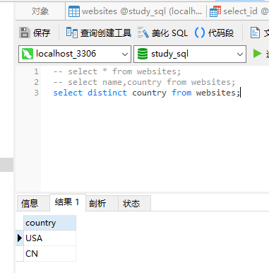

### select distinct

在表中，一个列可能会包含多个重复值，有时您也许希望仅仅列出不同（distinct）的值。

distinct 关键词用于返回唯一不同的值。

distinct 英 /dɪˈstɪŋkt/  美 /dɪˈstɪŋkt/ adj. 明显的；独特的；清楚的；有区别的

```MySql
select distinct column_name,column_name from table_name
```

```MySql
select distinct country from websites;
```
