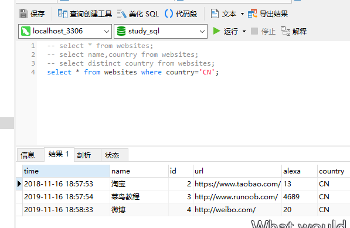

### 1、where子句语法

where 英 /weə(r)/  美 /hweə(r); hwɛr/ adv. 在哪里 pron. 哪里 conj. 在…的地方 n. 地点

where子句用于提取那些满足指定条件的记录。

```MySql
select column_name,column_name from table_name 
where column_name operator value
```

operator 英 /ˈɒpəreɪtə(r)/  美 /ˈɑːpəreɪtər/ 经营者；操作员；运营商；话务员；行家

column_name operator value 列操作值

```MySql
select * from websites 
where country='CN';
```


---
### 2、文本字段 vs. 数值字段

文本值 —— SQL 使用`单引号`来环绕文本值（大部分数据库系统也接受双引号）。

数值字段 —— 请不要使用引号。

---MySql
### 3、where 子句中的运算符

| 运算符 | 描述 |
| -::- | -::- |
| = | 等于  |
| <> | 不等于。注释：在 SQL 的一些版本中，该操作符可被写成 != |
| > | 大于 |
| <  | 小于 |
| >= | 大于等于 |
| <= | 小于等于 |
| between and | 在某个范围内 |
| like | 搜索某种模式 |
| in | 指定针对某个列的多个可能值 |
| is null | 空值判断 |

#### 4、逻辑运算的优先级：

| 运算符 | 描述 |
| -::- | -::- |
| and | 同时满足两个条件的值 |
| or | 满足其中一个条件的值(第一个值为true返回第一个值，否则返回第二个值) |
| not | 满足不包含该条件的值 |

```MySql
()    not        and         or
```

between 英 /bɪˈtwiːn/  美 /bəˈtwin/ prep. （空间、时间、数量等）在……之间；往返于；（表关系）两……之间；合用；一起 adv. （时间或空间）介于……之间；在期间