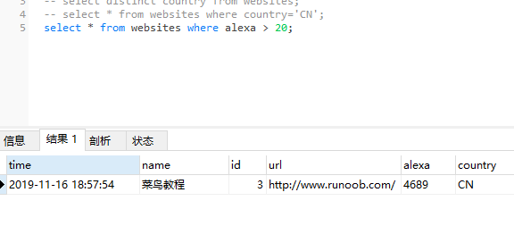

### where子句运算符大于>、小于<、不等于<> | ！=等

#### (1)、>大于
```
select * from websites 
where alexa > 20;
```


#### (2)、<小于
```
select * from websites 
where alexa < 100;
```

### (3)、不等于 <> | !=
```
select * from websites 
where alexa <> 100;

select * from websites 
where alexa != 100;
```

### (4)、大于等于 >=
```
select * from websites 
where alexa >= 100;
```

### (5)、小于等于 <=
```
select * from websites 
where alexa <= 100;
```