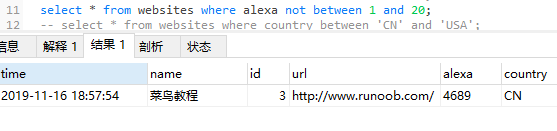

### where子句运算符between and

#### (1)、between 数值 and 数值
```
select * from websites 
where alexa between 13 and 20;
```


#### (2)、between 字符 and 字符
```
select * from websites 
where country between 'CN' and 'USA';
```


#### (3)、带not的between 字符 and 字符
```
select * from websites 
where alexa not between 1 and 20;
```


`重要事项`：
不同的数据库对 BETWEEN...AND 操作符的处理方式是有差异的。某些数据库会列出介于 "Adams" 和 "Carter" 之间的人，但不包括 "Adams" 和 "Carter" ；某些数据库会列出介于 "Adams" 和 "Carter" 之间并包括 "Adams" 和 "Carter" 的人；而另一些数据库会列出介于 "Adams" 和 "Carter" 之间的人，包括 "Adams" ，但不包括 "Carter" 。

所以，请检查你的数据库是如何处理 BETWEEN....AND 操作符的！

#### (4)、带in and 的'between 字符 and 字符'
选取 alexa 介于 1 和 20 之间但 country 不为 USA 和 IND 的所有网站：
```
select * from websites 
where (alexa between 1 and 20 ) and (country not in ('USA', 'IND'));
```
书写不加括号也可以 ，不过不易阅读。


#### (5)、between 日期 and 日期
选取 date 介于 '2016-05-10' 和 '2016-05-14' 之间的所有访问记录：
```
select * from websites 
where time between '2019-11-15 00:00:00' and '2019-11-18 00:00:00';
```
