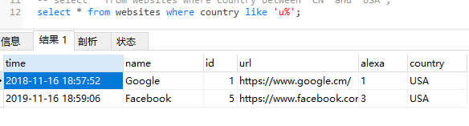
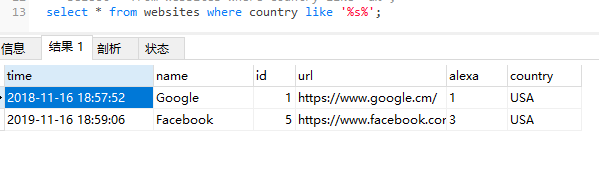
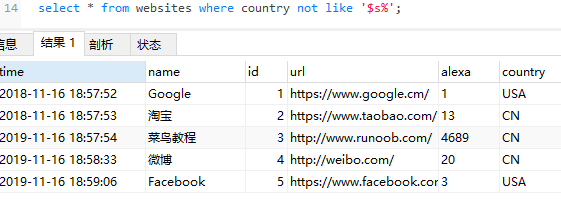
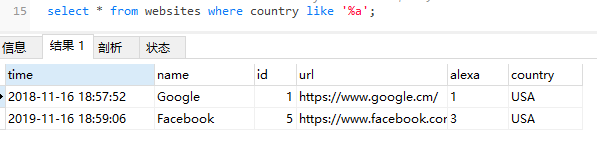
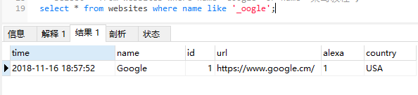
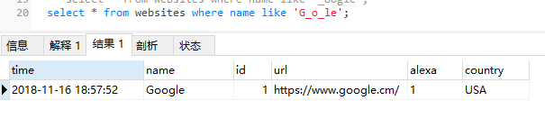
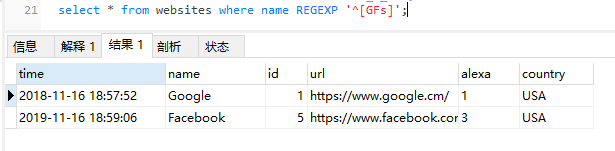
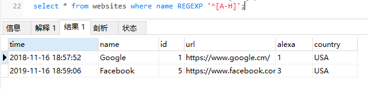

### where子句运算符like

提示："%" 可用于定义通配符（模式中缺少的字母）。

like 英 /laɪk/  美 /laɪk/ prep. 像，如同；符合……的方式；有……的特点；（用于询问）……怎么样；例如，好比 v. 喜欢；想；愿意；希望 conj. 好像；如同；像……一样 n. 爱好（常复数）；类似或同类的人或物 adj. 类似的，相似的；（图像）逼真的 adv. （非正式）可能；好像在说；和……一样 n. (Like) （美、俄、印、英、巴）莉凯（人名）
过去式 liked过去分词 liked现在分词 liking复数 likes第三人称单数 likes

---
#### 1.SQL 通配符

在 SQL 中，通配符与 SQL LIKE 操作符一起使用。

SQL 通配符用于搜索表中的数据。

在 SQL 中，可使用以下通配符：

| 通配符 | 描述 |
| -::- | -::- |
| % | 替代 0 个或多个字符  |
| _ | 替代一个字符 |
| [charlist] | 字符列中的任何单一字符 |
| [^charlist] 或 [!charlist]  | 不在字符列中的任何单一字符 |

`注意：[charlist] | [^charlist]是正则表达式的用法: ”^”这个字符是在中括号”[]”中被使用的话就是表示字符类的否定， 如果不是的话就是表示限定开头。`

---
#### 2.符号^
* ^，中文尚无通用名称，可以是乘方、插入符号、插入符、脱字符号等；英文称为caret (英语发音：/ˈkærət/)，是个倒 V 形的字素。
* 
* 说得明白一点，^ 就是 ASCII 码位 5Ehex 或其他字符集称为 帽子(hat)、控制符(control)又或 上箭头(uparrow) 的移格字符。
* 
* 其也可代表山形符号、逻辑异或符号、`幂`、尖牙、指标 ( Pascal (编程语言)), 或“楔子”。此字符不论在 ASCII或Unicode都代表扬抑符（因其历来在 overstrike 的作用），而 caret 则代表另一个相似但位于下方的 Unicode 字符：“‸”（CARET，U+2038）。此外还有一个带斜线的下方变形字符：“⁁”（CARET INSERTION POINT，U+2041）。

* overstrike /'ovəstraɪk/ v. （在硬币上）重复打印 n. （在已铸的硬币上）打印另一硬币的符号

---
#### 3.使用 SQL %(替代 0 个或多个字符) 通配符

* （1）、'u%' 选取 country 以字母 "u"(不区分大小写) 开头的所有客户：
```
select * from websites 
where country like 'u%';
```


* （2）、'%s%' 选取 country 包含模式 "s"(不区分大小写) 的所有客户：
```
select * from websites 
where country like '%s%';
```


* （3）、not '%s%' 选取 country 不包含模式 "s"(不区分大小写) 的所有客户：
```
select * from websites 
where country not like '%s%';
```


* （4）、'%a' 选取 name 以字母 "a"(不区分大小写) 结尾的所有客户
```
select * from websites 
where country like '%a';
```


---
#### 4.使用 SQL _(替代一个字符) 通配符
* 
```
select * from websites 
where name like '_oogle';
```


* 
```
select * from websites 
where name like 'G_o_le';
```


---
#### 5.使用 SQL [charlist] 通配符

MySQL 中使用 REGEXP 或 NOT REGEXP 运算符 (或 RLIKE 和 NOT RLIKE) 来操作正则表达式。

下面的 SQL 语句选取 name 以 "G"、"F" 或 "s" 开始的所有网站：

REGEXP n. 正则表达式；表达式对象

`注意： ”^”这个字符是在中括号”[]”中被使用的话就是表示字符类的否定， 如果不是的话就是表示限定开头。`

* 选取 name 以 "G"、"F" 或 "s" 开始的所有网站：
```
select * from websites 
where name REGEXP '^[GFs]';
```



* 选取 name 以 A 到 H 字母开头的网站：
```
select * from websites 
where name REGEXP '^[A-H]';
```


