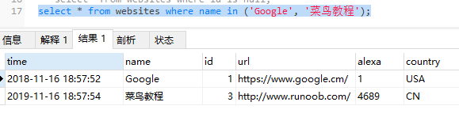
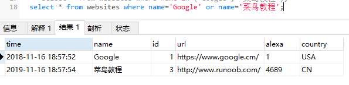

### where子句运算符in

* in 操作符允许您在 where 子句中规定多个值。

```
select * clomun_name(s) from table_name 
where column_name in (value1, value2, ...);
```
```
select * from websites 
where name in (google, '菜鸟教程')
```



* 等价于:
```
select * from websites where name='Google' or name='菜鸟教程'
```



* not in
```
select * from websites where name not in ('Google', '菜鸟教程');
```
