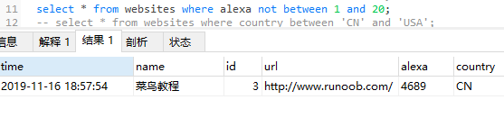
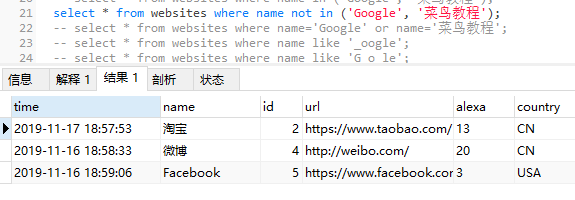
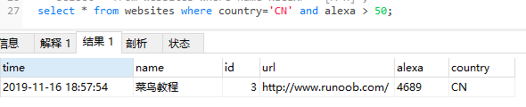
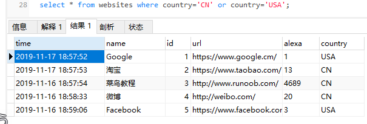
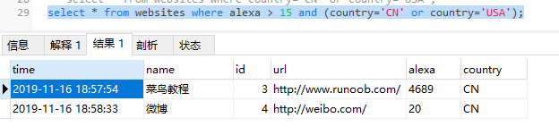

### where子句运算符not and or

如果第一个条件不成立，则 not 运算符显示一条记录。
如果第一个条件和第二个条件都成立，则 and 运算符显示一条记录。
如果第一个条件和第二个条件中只要有一个成立，则 or 运算符显示一条记录。

#### 1、not 运算符实例
```
select * from websites where alexa not between 1 and 20;
```


```
select * from websites where name not in ('Google', '菜鸟教程');
```


#### 2、and 运算符实例
```
select * from websites where country='CN' and alexa > 50;
```


#### 3、or 运算符实例
```
select * from websites where country='CN' or country='USA';
```


#### 4、结合 and & or
```
select * from websites where alexa > 15 and (country='CN' or country='USA');
```
