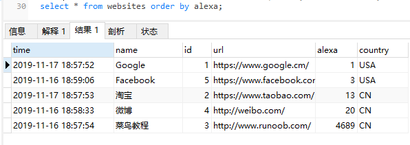
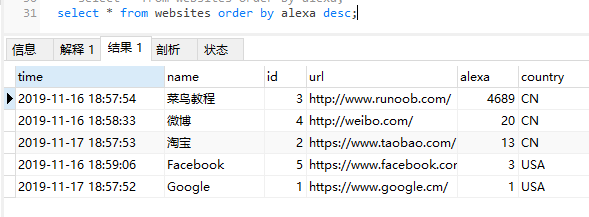
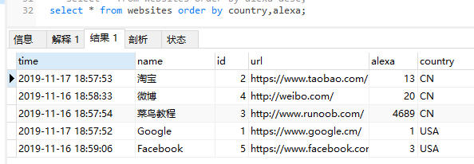
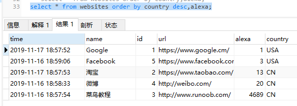

### order by

* order by 关键字用于对结果集按照一个列或者多个列进行排序。

* order by 关键字默认按照升序对记录进行排序。如果需要按照降序对记录进行排序，您可以使用 DESC 关键字。

* DESC abbr. 降序排列（descend 的缩写）
* descend 英 /dɪˈsend/  美 /dɪˈsend/ vi. 下降；下去；下来；遗传；屈尊 vt. 下去；沿…向下
* ascend 英 /əˈsend/  美 /əˈsend/  vi. 上升；登高；追溯 vt. 攀登，上升

```
select column_name,column_name from table_name order by column_name,column_name asc|desc

select * from websites order by alexa;
```

注意：order by 字段类型是'varchar'排序将按照第一个字母排序，'int | float'则按照大小进行排序。



### order by desc

```
select * from websites order by alexa desc;
```


### order by 多列

```
select * from websites order by alexa desc;
```


### order by 多列排序
```
select * from websites order by country desc,alexa;
|
select * from websites order by country desc,alexa desc;
```
