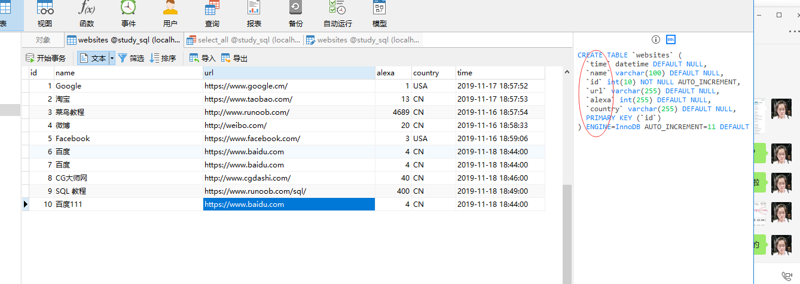
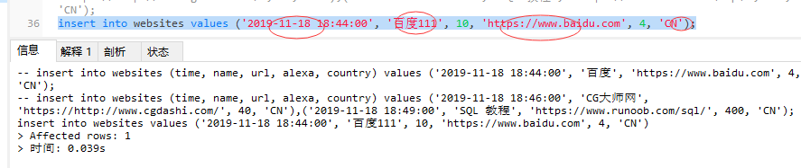
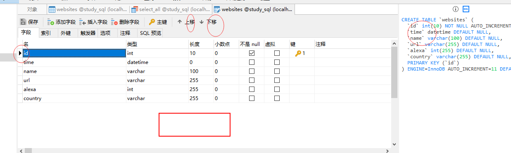
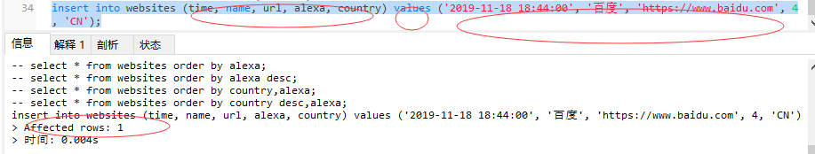
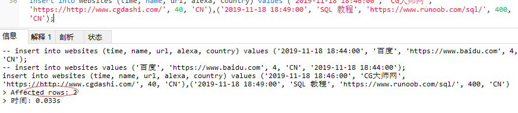

### insert into 语句

* insert into 语句用于向表中插入新记录。

* insert into 语句可以有两种编写形式。

---
#### (1.)第一种形式无需指定要插入数据的*列名*，只需提供被插入的*值*即可：

```
insert into table_name [values] (value1, value2, value3);

insert into websites values ('2019-11-18 18:44:00`, '百度111', 10, 'https://www.baidu.com', 4, 'CN');
```

*注意：值的顺序有要对应，和DDL（建表语句(DDL)）对应，见下图*




修改DDl方法：

---
#### (2.)第二种形式需要指定`列名`及被插入的`值`：
* 插入一条值:

```
insert into table_name [column1, column2, column3] values [value1, value2, value3, ...];

insert into websites (time, name, url, alexa, country) values ('2019-11-18 18:44:00', '百度', 'https://www.baidu.com', 4, 'CN');
```



*注意： 1.id未指定插入，需要设置id字段为‘自增类型’。2.多次运行会插入相同数据。*

* 插入多条值:

```
insert into websites (time, name, url, alexa, country) values ('2019-11-18 18:46:00', 'CG大师网', 'https://www.cgdashi.com/', 40, 'CN'),('2019-11-18 18:49:00', 'SQL 教程', 'https://www.runoob.com/sql/', 400, 'CN');
```


