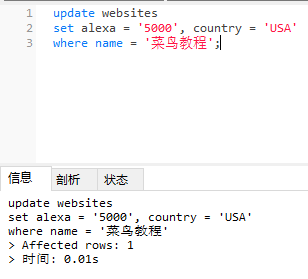

### update 语句

```
update table_name
set column = value1, column2 = value2l, ...
where some_column = some_value; 
```
*注意：WHERE 子句规定哪条记录或者哪些记录需要更新。如果您省略了 WHERE 子句，所有的记录都将被更新！*

```
update websites
set alexa = '5000', country = 'USA'
where name = '菜鸟教程';
```



*执行没有 WHERE 子句的 UPDATE 要慎重，再慎重。*