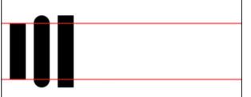
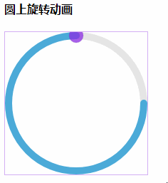

## 圆上任意一点公式

* 圆心坐标：(x0, y0)
* 半径：r
* 角度值：α (α * ( π / 180)为弧度值)
* 圆周率： π
* 则圆上任一点为：（x1, y1）

* 顺时针
> 
x1 = x0 + r * cos(α * ( π / 180))  
y1 = y0 + r * sin(α * ( π / 180)) 

* 逆时针
> 
x1 = x0 + r * sin(α * ( π / 180))  
y1 = y0 + r * cos(α * ( π / 180))

## 弧度和角度关系
* 弧度=(Math.PI/180)*角度。
* 360度的弧度 = 2π = 2 * Math.PI
* 1弧度 = π / 180 = Math.PI / 180

## 单位圆和sin()函数的关系
> 
> 
> 
## arc()语法
* arc(x, y, r, startAngle, endAngle, anticlockwise): 以(x, y)为圆心，以r为半径，从 startAngle弧度开始到endAngle弧度结束。anticlosewise是布尔值，true表示逆时针，false表示顺时针(默认是顺时针)。
* 注意：
> 这里的度数都是弧度。0 弧度是指的 x 轴正方形。

## lineCap = type
* 线条末端样式。
* 共有 3 个值：
> 
butt：线段末端以方形结束
round：线段末端以圆形结束
square：线段末端以方形结束，但是增加了一个宽度和线段相同，高度是线段厚度是一半的矩形区域。


## fillStyle、strokeStyle
* fillStyle = color 设置图形的填充颜色
* strokeStyle = color 设置图形轮廓的颜色
* 备注:
>1. color 可以是表示 css 颜色值的字符串、渐变对象或者图案对象。
>2. 默认情况下，线条和填充颜色都是黑色。
>3. 一旦您设置了 strokeStyle 或者 fillStyle 的值，那么这个新值就会成为新绘制的图形的默认值。如果你要给每个图形上不同的颜色，你需要重新设置 fillStyle 或 strokeStyle 的值。

## `<canvas id='canvas' width='100' height='100'></canvas>`
* 注意: width和height是必须的， 否则js渲染时候尺寸位置变形啦

## 圆上旋转动画

```
<html !DOCTYPE>
<html>
<body>
<!-- 注意: width和height是必须的， 否则js渲染时候尺寸位置变形啦 -->
<canvas id='canvasCircleRorate' width="200" height="200" class="canvas"></canvas>
<script type='text/javascript'>
window.onload=function(){
	// 全局常量定义
	const canvas = document.getElementById('canvasCircleRorate')
	const ctx = canvas.getContext('2d')
	const canvasW = canvas.width // 必须canvas定义属性width
	const canvasH = canvas.height // 必须canvas定义属性height
	const onceAngle =  Math.PI / 180 // 1度的圆周值 // 1圆周 = 2π 
	const centerX = canvasW / 2 // 中心点x
	const centerY = canvasH / 2 // 中心点y
	const r = canvasW / 2 // 半径
	const circleW = 10 // 圆周宽度
	/*
     * 圆圈背景
     */

	let circleBG = function(){
	    let r1 = r - circleW / 2 // 半径 (减去圆周宽度的一半)
	    let startAngle = 0   // 开始圆周值
	    let endAngle = onceAngle * 360       // 结束圆周值
	    ctx.beginPath()
	    ctx.arc(centerX, centerY, r1, startAngle, endAngle, false)  // anticlockwise（是否逆时针） => 默认false
	    ctx.strokeStyle = 'rgba(0,0,0,0.1)'
	    ctx.lineWidth = circleW
	    ctx.stroke()
	}
	/*
     * 圆圈上旋转动画
     */
	let circleAni = function () {
		let r1 = r - circleW / 2 // 半径 (减去圆周宽度的一半)
		let startAngle = 0 // 开始圆周值
		let maxAngle = 270  // 旋转到最大度数
		let addUpAngle = 0 // 累加角度值
		let circleIntrvalNum = 0 // 计算setInterval执行了多少次
		let circleIntrval = setInterval(() => {
		  ctx.save()   // 为了之后的绘制还原
		  ctx.clearRect(0, 0, canvasW, canvasH) // 清除所有内容 不清楚的话会有很多圆圈叠加导致圆圈有锯齿
		  let endAngle = (addUpAngle += 1) * onceAngle // 结束圆周值
		  ctx.beginPath()
		  ctx.arc(centerX, centerY, r1, startAngle, endAngle, false) // anticlockwise（是否逆时针） => 默认false
		  ctx.lineWidth = circleW // 作用域于整setInterval函数内
		  ctx.lineCap = 'round'
		  ctx.strokeStyle = '#54bef1'
		  ctx.stroke()
		  ctx.restore() // 还原所有内容
		  // 动画背景  // 缺点会和setInterval执行很多次
		  circleBG()
		  // 圆上任意一点动画
		  circleDotAni(addUpAngle)
		  circleIntrvalNum += 1
		  // 度数上限
		  if (addUpAngle >= maxAngle) {
		    clearInterval(circleIntrval)
		  }
		}, 20)
	}
	// 执行圆圈动画
  	circleAni()

	/*
     * 圆上点旋转动画
     */
	let circleDotAni = (addUpAngle = 0) => {
		/***
		 * @author 小白
		 * @params 圆上任意一点公式:
		 * @params 圆心坐标：(x0, y0)
		 * @params 半径：r
		 * @params 角度值：α (α * ( π / 180)为弧度值)
		 * @params 圆周率： π
		 * @params 则圆上任一点为：（x1, y1）
		 * @params 则圆上任一点为：（x1, y1）
		 * @params 顺时针:
		 * @params x1 = x0 + r * cos(α * ( π / 180))  
		 * @params y1 = y0 + r * sin(α * ( π / 180))  
		 * @params 逆时针:
		 * @params x1 = x0 + r * sin(α * ( π / 180))  
		 * @params y1 = y0 + r * cos(α * ( π / 180))
		 */
		
		 // 顺时针
		 ctx.beginPath() // 记得重新开始绘制路径
		 let r1 = r - circleW / 2 // 半径 (减去圆周宽度的一半)
		 let r2 = 10
		//  let addUpAngle = 0 // 累加角度值
		 let x1 = centerX + r1 * Math.cos(addUpAngle * onceAngle)
		 let y1 = centerY + r1 * Math.sin(addUpAngle * onceAngle)
		 ctx.arc(x1, y1, r2, 0, 2 * Math.PI, false) // anticlockwise是否逆时针 => false
		 ctx.lineWidth = 1
		 ctx.stroke()
		 ctx.fillStyle = '#892be2BF'
		 ctx.fill()
	}
	// circleDotAni(addUpAngle = 90)
}
</script>
<style type="text/css">
.canvas{
  border:solid 1px #f00;
}
</style>
</body>
</html>
```