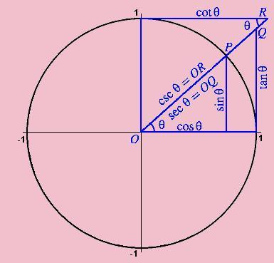

## 圆上任意一点公式

* 圆心坐标：(x0, y0)
* 半径：r
* 角度值：α (α * ( π / 180)为弧度值)
* 圆周率： π
* 则圆上任一点为：（x1, y1）

* 顺时针
> 
x1 = x0 + r * cos(α * ( π / 180))  
y1 = y0 + r * sin(α * ( π / 180)) 

* 逆时针
> 
x1 = x0 + r * sin(α * ( π / 180))  
y1 = y0 + r * cos(α * ( π / 180))

## 弧度和角度关系
* 弧度=(Math.PI/180)*角度。
* 360度的弧度 = 2π = 2 * Math.PI
* 1弧度 = π / 180 = Math.PI / 180

## 单位圆和sin()函数的关系
> 
> 
> 
## arc()语法
* arc(x, y, r, startAngle, endAngle, anticlockwise): 以(x, y)为圆心，以r为半径，从 startAngle弧度开始到endAngle弧度结束。anticlosewise是布尔值，true表示逆时针，false表示顺时针(默认是顺时针)。
* 注意：
> 这里的度数都是弧度。0 弧度是指的 x 轴正方形。

## lineCap = type
* 线条末端样式。
* 共有 3 个值：
> 
butt：线段末端以方形结束
round：线段末端以圆形结束
square：线段末端以方形结束，但是增加了一个宽度和线段相同，高度是线段厚度是一半的矩形区域。

## fillStyle、strokeStyle
* fillStyle = color 设置图形的填充颜色
* strokeStyle = color 设置图形轮廓的颜色
* 备注:
>1. color 可以是表示 css 颜色值的字符串、渐变对象或者图案对象。
>2. 默认情况下，线条和填充颜色都是黑色。
>3. 一旦您设置了 strokeStyle 或者 fillStyle 的值，那么这个新值就会成为新绘制的图形的默认值。如果你要给每个图形上不同的颜色，你需要重新设置 fillStyle 或 strokeStyle 的值。

## `<canvas id='canvas' width='100' height='100'></canvas>`
* 注意: width和height是必须的， 否则js渲染时候尺寸位置变形啦

## 圆上旋转动画
