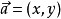
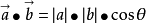
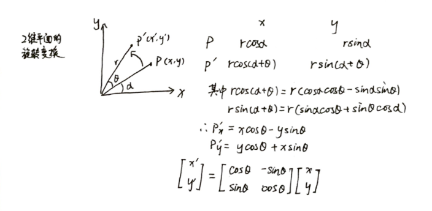

## [向量运算基础和矩阵变换](https://www.edx.org/course/computer-graphics)

电脑图像（课程）
在这个介绍性计算机图形学课程中学习如何实时创建3D场景图像并使用逼真的光线跟踪。
网址：https://www.edx.org/course/computer-graphics

___
### 基础运算

#### (1、)点积（Dot Product）(数量积、内积)

将**向量相乘（外积、叉积）**得到一个**标量** 可以通过两个向量除以它们的模得到两个向量之间的**夹角**

向量的模 

数量积（内积、点积）

向量积（外积、叉积）（法向量）∣a×b∣=|a|·|b|·sin〈a，b〉

用途：
* 求两个向量之间的夹角（光源和表面之间夹角的余弦值对于投影来说非常重要）
* 找到一个向量在另一向量上的投影也非常重要（比如我们想知道一个点在新的坐标系下的坐标）。
* 点积在笛卡尔坐标系下很有用

b向量在a向量上投影的计算：

#### (2、)叉积（Cross Product）

向量积（外积、叉积）∣a×b∣=|a|·|b|·sin〈a，b〉

将向量相乘得到一个正交向量（垂直于向量a和向量b）

叉积所得到的向量的方向可以通过右手坐标系来得到：

用右手食指代表叉积中前一个向量，用中指代表叉积中后一个向量，则大拇指的方向就是叉积得到的向量方向。这简单的方法能提醒你将进行叉积的两个向量顺序调换的话，得到的向量方向会相反。

叉积可以用向量 a 的对偶矩阵来完成，所以可以将它表示成A星(A*)乘以b，其中A*是向量a的对偶矩阵（共轭转置）。

### (3、)正交坐标系

正交基和坐标系对于表示点的位置非常重要，因为在图形学中，我们通常需要很多不同的坐标系，来表示点在不同参照物下的位置。例如，要表示自己身前一台电脑的位置，可以在自己的位置建立一个坐标系来表示电脑的位置，要表示北极的位置时，用地球的坐标系表示北极的位置会更容易。

所以任意三个向量的集合(在3D中)

___
## 矩阵

图形学中矩阵很重要，因为大多数变换都涉及一个矩阵乘以一个向量，矩阵可以用来变换点。下面简单的列一下矩阵的性质，更多的性质可以参考下[维基页面矩阵](https://www.wikiwand.com/zh-hans/%E7%9F%A9%E9%98%B5)。

___
## 矩阵变换

### 缩放

二维空间下和三维空间下的缩放很简单，直接乘上相应的缩放倍数即可。

### 切变

### 旋转

**二维空间下的旋转**

二维空间下，物体的旋转可以靠矩阵在X方向的变换于矩阵在Y方向的变换叠加得到，但不适用于三维空间。

下面是推导过程：

这三种矩阵变换不符合交换律，也就是说变换的顺序改变会得到不同的结果，要恢复变换的话也要从最后一次变换开始恢复。（Unity的默认变换顺序是先缩放，再旋转，最后平移）

**三维空间下的旋转**

1. 下图分别给出了绕Z轴旋转、X轴旋转和Y轴旋转的变换矩阵：

二维旋转可以看作是绕着Z轴的特殊旋转，因为Z轴保持不变。因此Rz（绕着Z轴的旋转）可以直接在二维空间旋转矩阵外的Z轴处填充1和0来使用，同理可得绕X轴的旋转矩阵和Y轴的旋转矩阵。

2. 绕任意轴旋转

在这其中，三个正交向量（相互垂直）可以构成一个旋转矩阵，这样就可以将点映射到新的坐标系下。这个概念非常重要，因为在图形学中常常需要这样的变换，如把每个3D模型的顶点的法线从模型空间转到剪裁空间（不同的坐标系）再统一进行计算。

这个旋转矩阵的逆只需要将XYZ轴换成u，v，w即可。

详见罗德里格旋转公式

___
## 罗德里格旋转公式

罗德里格旋转公式是计算三维空间中，一个向量绕旋转轴旋转给定角度以后得到的新向量的计算公式。这个公式使用原向量，旋转轴及它们叉积作为标架表示出旋转以后的向量。可以改写为矩阵形式，被广泛应用于空间解析几何和计算机图形学领域，成为刚体运动的基本计算公式。

向量积（外积、叉积）（法向量）∣a×b∣=|a|·|b|·sin〈a，b〉

### 发现历程和定义

在向量旋转公式发现以前，瑞士数学家列昂哈德·欧拉(Leonhard Euler(1707-1783))为了证明四平方和定理，发现了四平方和恒等式。然而这个恒等式的构造过程非常繁琐。直到后来，四元数被引入，使得这个恒等式的推导大大简化。

四元数可以很方便地表示旋转变换。但在很多场合中，使用矩阵形式和向量形式表达旋转更有利于推导。向量旋转公式最早由法国数学家本杰明·奥伦德·罗德里格(Benjamin Olinde Rodrigues(1795–1851))导出，后来被应用在很多领域。

设v是一个三维空间向量，k是旋转轴的单位向量，则v在右手螺旋定则意义下绕旋转轴k旋转角度θ得到的向量可以由三个不共面的向量v, k和k×v构成的标架表示：

### 推导

如果被旋转向量v与旋转轴k(k为单位向量)相互垂直，那旋转变换不难表示。而对于与旋转轴k呈任意角度的向量v，可以通过正交分解，把被旋转向量转化为与旋转轴平行的分量和与旋转轴垂直的分量，其中与旋转轴平行的分量在旋转中是不变的，而与旋转轴垂直的分量则恰好旋转了角度θ，把与旋转轴平行的分量与旋转以后的与旋转轴垂直的分量加在一起，即可得到旋转以后的向量。

第一步是如何对向量v做正交分解：

利用向量投影公式，可以得到  的表达式：

通过做减法，得到

利用外积可以计算与和k都垂直，且长度等于的向量w：

旋转以后的向量可以表示为：

与相加即可得到旋转以后的向量表达式：

### 矩阵形式

在计算机图形学中，罗德里格向量旋转公式通常被用来填写旋转矩阵。如果把k和v分别写为列向量：

则旋转以后的向量可以表示为：

其中

其中E是3阶单位矩阵。需要注意的是，公式中的第二项不是点积，而是张量积，得到的是一个3行3列的矩阵。
