## sin()函数的相关
 * sinx函数，即正弦函数，三角函数的一种。对于任意一个实数x都对应着唯一的角（弧度制中等于这个实数），而这个角又对应着唯一确定的正弦值sinx，这样，对于任意一个实数x都有唯一确定的值sinx与它对应，按照这个对应法则所建立的函数，表示为y=sinx，叫做<b>正弦函数</b>。

### 锐角正弦函数

* 在直角三角形ABC中，∠C(角C)是直角，AB是∠c斜边，BC是∠A的对边，AC是∠B的对边。
* 正弦函数就是sin(A)=a/c
* sinA=∠A(角A)的对边：斜边
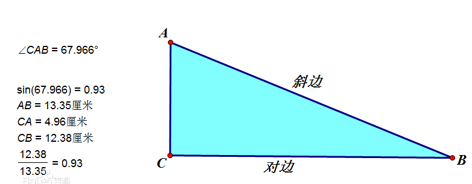

### 单位圆定义

* 描述：单位圆指的是平面直角坐标系上，圆心为原点，半径为单位长度的圆

* 定义：如果单位圆上的点 (x, y)位于第一象限，那么x与y是斜边长度为1的直角三角形的两条边，根据勾股定理，x与y满足方程：
> 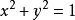

* 由于对于所有的x来说x2 = (−x)2，并且所有这些点相对于x轴或者y轴的反射点也都位于单位圆上，因此单位圆上的所有点都满足上面的方程。

* 在三角学中，单位圆通常是指欧几里德平面直角坐标系中圆心为 （0,0）、半径为 1 的圆。在教科书中，它常常出现在三角函数入门的那几页，并且与称为三角函数线的几条线段在一起，用于定义或解释实数的三角函数值。一般地，在复平面内，n 个 n 次的单位根所对应的点正。

* 数学性质
> 1. 在复平面（即高斯平面）上，单位圆诱导了著名的欧拉公式和棣莫佛定理。 换句话说， 单位圆上的点表示模长为1的复数， 它诱导了复数的三角形式和指数形式之间的关系。
> 2. 单位圆上有自然的群结构： 即弧度的加法群结构。换句话说，就是模长为1的复数集合 上有一个自然的乘法结构。
> 3. 单位圆诱导了几何反演变换，这和复变函数论的诸多结论密切相关。
> 4. 单位圆是最简单的非单连通的拓扑空间之一，常记为S^1. 它的基本群同构于整数群。
> 5. 单位圆同胚于射影直线，是拓扑学中最基本的研究对象。这个同胚映射来自于从北极点作的球极投影。
> 6. 单位圆盘到自身的连续映射一定存在不动点。这就是著名的布威劳尔不动点定理 。
> 7. 单位圆的群结构诱导了著名的指数映射，和微分几何中著名的陈类（也称陈示性类，因陈省身得名）有着深远的联系。

* 单位圆和sin()函数的关系
> 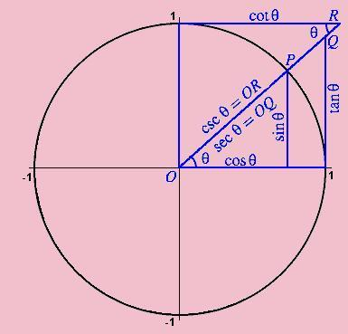
> 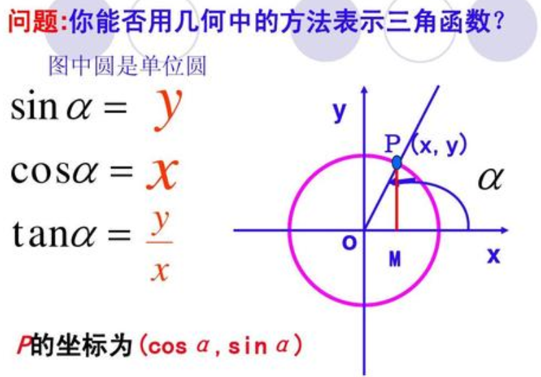

* 设一个过原点的线，同x轴正半部分得到一个角α，并与单位圆相交。这个交点的y坐标等于 sinα。在这个图形中的三角形确保了这个公式；半径等于斜边并有长度 1，所以有了 sinα=y/1。单位圆可以被认为是通过改变邻边和对边的长度并保持斜边等于 1 查看无限数目的三角形的一种方式。即sinα=PM，与y轴正方向一样时正，否则为负。
* 对于大于 2π(圆周=2π) 或小于 α 的角度，简单的继续绕单位圆旋转。在这种方式下，正弦变成了周期为 2π的周期函数。

## 圆上任意一点公式

* 圆心坐标：(x0, y0)
* 半径：r
* 角度值：α (α * ( π / 180)为弧度值)
* 圆周率： π
* 则圆上任一点为：（x1, y1）

* 顺时针
> 
x1 = x0 + r * cos(α * ( π / 180))  
y1 = y0 + r * sin(α * ( π / 180)) 

* 逆时针
> 
x1 = x0 + r * sin(α * ( π / 180))  
y1 = y0 + r * cos(α * ( π / 180))

## 弧度和角度关系
* 弧度=(Math.PI/180)*角度。
* 360度的弧度 = 2π = 2 * Math.PI
* 1弧度 = π / 180 = Math.PI / 180

### 符号α
* 阿尔法，alpha，即α，是希腊字母表的第一个字母，有第一个、开端、最初的含意。

### 数学符号∠

* 用于表<b>示角和斜度</b>。

* 一、　数学符号：角
> 
①.角的静态定义：具有公共端点的两条射线组成的图形叫做角，这个公共端点叫做角的顶点，这两条射线叫做角的两条边。
②.角的动态定义：一条射线绕着它的端点从一个位置旋转到另一个位置所形成的图形叫做角，所旋转射线的端点叫做角的顶点，开始位置的射线叫做角的始边，终止位置的射线叫做角的终边
> 
∠n表示第n个角,<b>读做"角n"</b>.如果射线旁边写了字母，如：射线a与射线b在同一个端点上重叠，便可以叫这个叫为∠ab

* 二、斜度
> 
①.一条直线（或平面）相对于另一条直线（或平面）的倾斜程度，用作符号∠，（注：符号的方向应与斜度的方向一致）<b>斜度α=H：L=1：n；</b>
②.斜度的比值简化为1：n的形式；

* 怎样打出符号
> 按住换档键（ALT）不放，然后按小键盘41423，最后放开Alt键，∠就出来了

### 符号^
* ^，中文尚无通用名称，可以是乘方、插入符号、插入符、脱字符号等；英文称为caret (英语发音：/ˈkærət/)，是个倒 V 形的字素。
* 
* 说得明白一点，^ 就是 ASCII 码位 5Ehex 或其他字符集称为 帽子(hat)、控制符(control)又或 上箭头(uparrow) 的移格字符。
* 
* 其也可代表山形符号、逻辑异或符号、幂、尖牙、指标 ( Pascal (编程语言)), 或“楔子”。此字符不论在 ASCII或Unicode都代表扬抑符（因其历来在 overstrike 的作用），而 caret 则代表另一个相似但位于下方的 Unicode 字符：“‸”（CARET，U+2038）。此外还有一个带斜线的下方变形字符：“⁁”（CARET INSERTION POINT，U+2041）。

* overstrike /'ovəstraɪk/ v. （在硬币上）重复打印 n. （在已铸的硬币上）打印另一硬币的符号

### 基本性质

<b>图像</b>
* 图像是波形图像（由单位圆投影到坐标系得出），叫做正弦曲线(sine curve)

* 下面是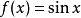的函数图像：
*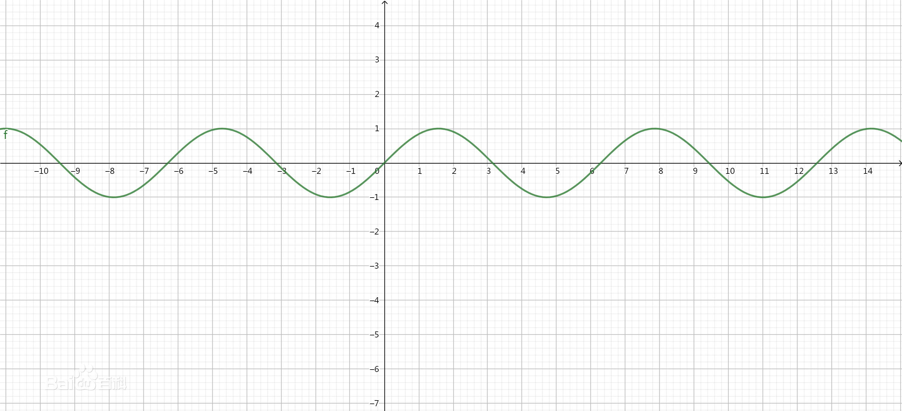

<b>定义域</b>
* 实数集R，可扩展到复数集C

<b>值域</b>
[-1,1] （正弦函数有界性的体现）

<b>最值和零点</b>
* ①最大值：当x=2kπ+(π/2) ，k∈Z时，y(max)=1
* ②最小值：当x=2kπ+(3π/2)，k∈Z时，y(min)=-1
* 零值点： (kπ,0) ，k∈Z

<b>对称性</b>
* 1)对称轴：关于直线x=(π/2)+kπ，k∈Z对称
* 2)中心对称：关于点(kπ,0)，k∈Z对称

<b>周期性</b>
* 最小正周期：2π

<b>奇偶性</b>
* 奇函数 (其图象关于原点对称)

<b>单调性</b>
* 在[-(π/2)+2kπ,(π/2)+2kπ]，k∈Z上是增函数
* 在[(π/2)+2kπ,(3π/2)+2kπ]，k∈Z上是减函数

### 正弦函数
* 正弦型函数解析式： (y = Asin(ωx + φ) + b)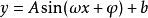
* 各常数值对函数图像的影响：
> ω：<b>决定周期（最小正周期(y = Asin(ωx + φ) + b)）</b>
> ω: 注意:值在0到1之间
> φ：<b>决定波形与X轴位置关系或横向移动距离（左加右减）</b>
> A：<b>决定峰值（即纵向拉伸压缩的倍数）</b>
> b：<b>表示波形在Y轴的位置关系或纵向移动距离（上加下减）</b>
>
> ω 中文读音：欧米伽 Omega（大写Ω，小写ω ），又称为大O，是第二十四个希腊字母，亦是最后一个希腊字母。电阻的单位. Omega用作指事情的终结，对应指开始的Alpha，例如：我是Alpha、我是Omega、我是首先的、我是末后的、我是初、我是终。（圣经启示录 22:13）
>
> φ，Phi，音标 /faɪ/。根据现代汉语词典第六版希腊字母读音表， φ 的中文读音为“斐” 。在物理范围的运用中，音标为 /fi:/。
>

### 动画运用
* 正弦型函数解析式：(y = Asin(ωx + φ) + b) 

1. A: 当sin(x)乘以一个数A，可以改变值域，也就是峰值
系数大于1时曲线更陡峭，小于1大于0时曲线更缓。
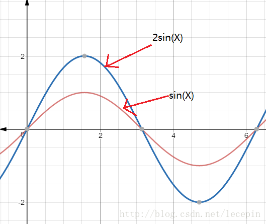

2. φ: 当sin(x ± φ)时，实现曲线的左右移动，左加右减。
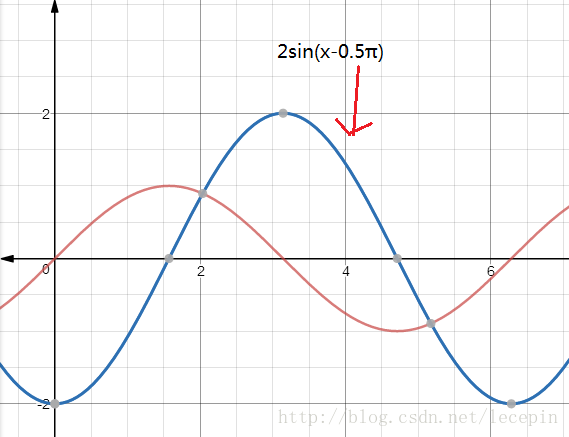

3. ω: 当sin(x * ω)时，曲线的周期会变化，ω>1时，周期变短；0<ω<1时，周期变长。
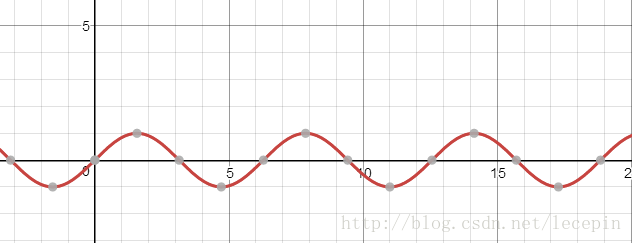

### 绘制正弦曲线波浪动画

*  <b>window.requestAnimationFrame(callback)语法(请求帧动画)</b>

*  window.requestAnimationFrame(callback) 告诉浏览器——你希望执行一个动画，并且要求浏览器在下次重绘之前调用指定的回调函数更新动画。该方法需要传入一个回调函数作为参数，该回调函数会在浏览器下一次重绘之前执行

* 注意：若你想在浏览器下次重绘之前继续更新下一帧动画，那么回调函数自身必须再次调用window.requestAnimationFrame() => 也就是循环执行,在回调函数内部使用

* request 英 /rɪ'kwest/  美 /rɪ'kwɛst/ n. 请求；需要 vt. 要求，请求
* animation 英 /ænɪ'meɪʃ(ə)n/  美 /,ænɪ'meʃən/ n. 活泼，生气；激励；卡通片绘制
* request aniamtion frame 请求帧动画

### 效果展示

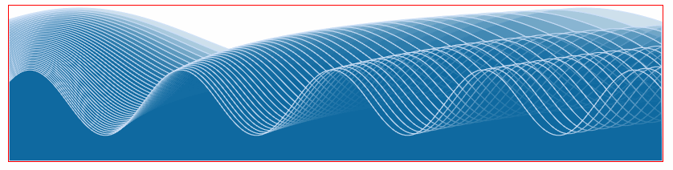