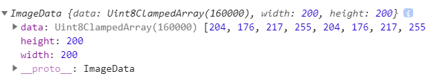
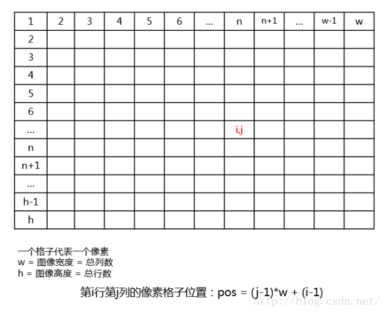
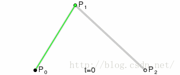
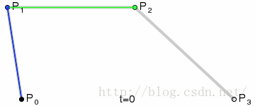
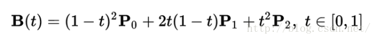
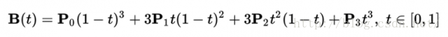

## 图片粒子动画

### drawImage()

* 把一个image对象或者canvas上（甚至是video对象上的的每一帧）指定位置和尺寸的图像绘制到当前的画布上。

### ctx.getImageData(x,y,width,height)

*  获取图像的像素信息


* data是一个Uint8ClampedArray类型的一维数组，包含了整个图片区域里每个像素点的RGBA的整型数据。如下图描述的data数组：

* Uint abbr. 无符号整型（unsigned int）
* clamped /klæmpt/ adj. 夹紧的 v. 夹住；强制实行；用沉重脚步行走（clamp的过去分词）

* 根据数列规则可以知道，要获取第n个位置（n从1开始）的R、G、B像素信息就是：Rn = (n-1)*4，Gn = (n-1)*4+1，Bn = (n-1)*4+2，An = (n-1)*4+3

* 实际上图像是一个包括image.height行，image.width列像素的矩形而不是单纯的一行到结束的，这个n值在矩形中要计算下：


```
	// 得到像素点位置
	let particleArr = []
	let imageDataPosition = () => {
		let rows = 100 // 像素行
		let columns = 100 // 像素列
		let cellWidth = imgWidth / rows  // 单元格宽度
		let cellHeight = imgHeight / columns // 单元格高度
		// 行循环
		for(let row = 1; row < rows; row++){
		  // 列循环
		  for(let column = 1; column < columns; column++){
		    // 获取每个像素点的rgba中的R
		    // 越靠近蓝色 值越小 甚至是个位数R值
		    let position = [(row - 1) * cellWidth)* imgWidth + ((column - 1) * cellHeight)] * 4
		    console.log(imgData[position])
		    // console.log(position)
		    if(imgData[position] > 100) {
		      let particle = {
		        // x,y都随机偏移
		        x: row * cellWidth + (Math.random() - 0.5) * 20,
		        y: column * cellHeight + (Math.random() - 0.5) * 20,
		        // fillStyle: '#006eff'  //蓝色
		        fillStyle: '#006eff'  //蓝色
		      }
		      particleArr.push(particle)
		    }
		  }
		}
	}
	imageDataPosition()
	// 绘制图案
	let drawImage = () => {
	ctx.clearRect(0, 0, canvasW, canvasH)
	for(let i = 0; i < particleArr.length; i++) {
	  ctx.fillStyle=particleArr[i].fillStyle
	  ctx.fillRect(particleArr[i].x, particleArr[i].y, 1, 1)
	}
	}
	drawImage()
```

### el.naturalWidth el.naturalHeight

* 浏览器中获取实际宽度和高度 
* natural 英 /ˈnætʃrəl/ 美 /'nætʃrəl/  adj. 自然的；物质的；天生的；不做作的 n. 自然的事情；白痴；本位音

### 制作粒子动画

* 一种是粒子漂浮类，这种比较简单，只需要随机的改变每个粒子的位置值，然后一直执行setInterval或者requestAnimationFrame重绘画布即可

* 另外一种如下粒子动画轨迹

### 粒子动画轨迹

* 制作缓动效果有两种方法： 
>1. 一种是自己设定好控制点，然后通过贝塞尔曲线公式来计算每个单位时间的坐标值。
>> formula 英 /'fɔːmjʊlə/  美 /'fɔrmjələ/ n. [数] 公式，准则；配方；婴儿食品 复数 formulas或formulae
>>


>> 
>> 求曲线的公式是根据*德卡斯特里奥*算法计算得来的
>> 二次曲线对应的公式：
>>> 
>> 三次曲线对应的公式：
>>> 
>> 具体代码以及原理见算法文档章节
>> 
>2. 另外一种方法就是使用已有的缓动函数，这里使用出名的Tween算法的缓动函数
> tween 英 /twiːn/  美 /twin/ prep. 在……之间 n. 10至12岁之间的少年
> 具体代码以及原理见算法文档章节
