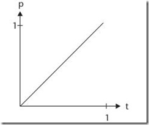

## Tween算法及缓冲特效

### 缓入缓出曲线：

* 缓入：起始速度很慢，然后开始加速度。运动曲线（此时，斜率从0开始，并逐渐向1靠近）
* 

* 缓出：起始速度很快，然后减速，直到速度为0。运动曲线（斜率从1开始，逐渐向0靠近）
* 

* 缓入缓出：这个运动演示了物体运动从开始到结束的全过程（斜率从0到1，再从1到0）
*  

### 符号^
* ^，中文尚无通用名称，可以是乘方、插入符号、插入符、脱字符号等；英文称为caret (英语发音：/ˈkærət/)，是个倒 V 形的字素。
* 
* 说得明白一点，^ 就是 ASCII 码位 5Ehex 或其他字符集称为 帽子(hat)、控制符(control)又或 上箭头(uparrow) 的移格字符。
* 
* 其也可代表山形符号、逻辑异或符号、幂、尖牙、指标 ( Pascal (编程语言)), 或“楔子”。此字符不论在 ASCII或Unicode都代表扬抑符（因其历来在 overstrike 的作用），而 caret 则代表另一个相似但位于下方的 Unicode 字符：“‸”（CARET，U+2038）。此外还有一个带斜线的下方变形字符：“⁁”（CARET INSERTION POINT，U+2041）。

* overstrike /'ovəstraɪk/ v. （在硬币上）重复打印 n. （在已铸的硬币上）打印另一硬币的符号

### 直线匀速缓动

* 曲线图示：

* 函数方法：
> position = time * (distance / totalTime) + beginingPositionX
> 
* 函数方法参数：
> 
positionX: x位置
time: 时间
velocity: 速度
distanceX: x距离
totalTime: 总时间
beginingPositionX: x开始位置
速度 = 距离 ÷ 总时间 velocity = distanceX ÷ totalTime
位置 = 时间 × 速度 positionX = time × velocity
位置 = 时间 × (距离 / 总时间) positionX = time × (distanceX ÷ totalTime)
位置 = 时间 × (距离 / 总时间) positionX = time × (distanceX ÷ totalTime) + beginingPositionX

* velocity 英 /vəˈlɒsəti/  美 /vəˈlɑsəti/  n. 【物】速度
* uniform 英 /'juːnɪfɔːm/  美 /junəˌfɔrm/ adj. 统一的；一致的；相同的；均衡的；始终如一的 n. 制服 vt. 使穿制服；使成一样
* motion 英 /'məʊʃ(ə)n/  美 /'moʃən/ n. 动作；移动；手势；请求；意向；议案 vi. 运动；打手势 vt. 运动；向…打手势
* sportive 英 /'spɔːtɪv/  美 /'spɔrtɪv/ adj. 运动的；嬉戏的；闹着玩的；适合运动穿戴的
* minus 英 /'maɪnəs/  美 /'maɪnəs/ prep. 减，减去；零下；（非正式）无，欠缺（曾经有过的东西）n. 减号，负号；（非正式）负数，负值；（非正式）缺点，不足adj. 减的；（尤指温度）负的，零下的；负面的；略低的；阴性的

* 运用效果 

### 二次缓动

* 曲线类型：二次方曲线（抛物线），p(t) = t ^ 2
* 曲线图示：
* 
* quadratic 英 /kwɒ'drætɪk/  美 /kwɑ'drætɪk/ adj. [数] 二次的 n. 二次方程式

* 一般地，我们把形如y=ax²+bx+c（其中a，b，c是常数，a≠0）的函数叫做二次函数，其中a称为二次项系数，b为一次项系数，c为常数项。x为自变量，y为因变量。等号右边自变量的最高次数是2。

