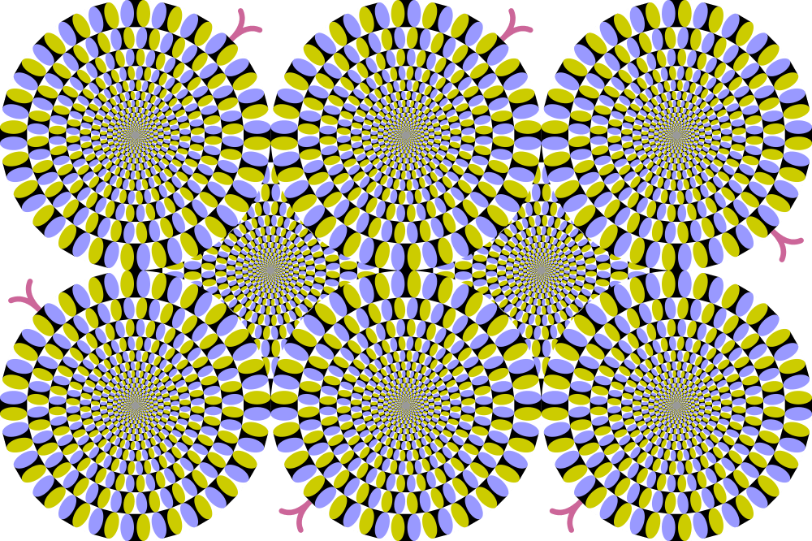
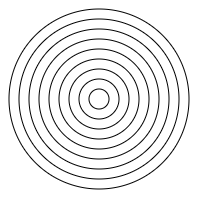
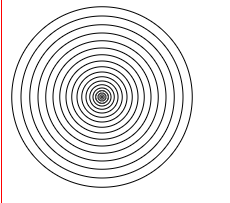
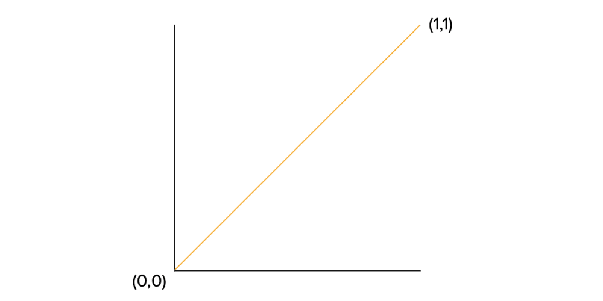
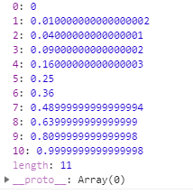
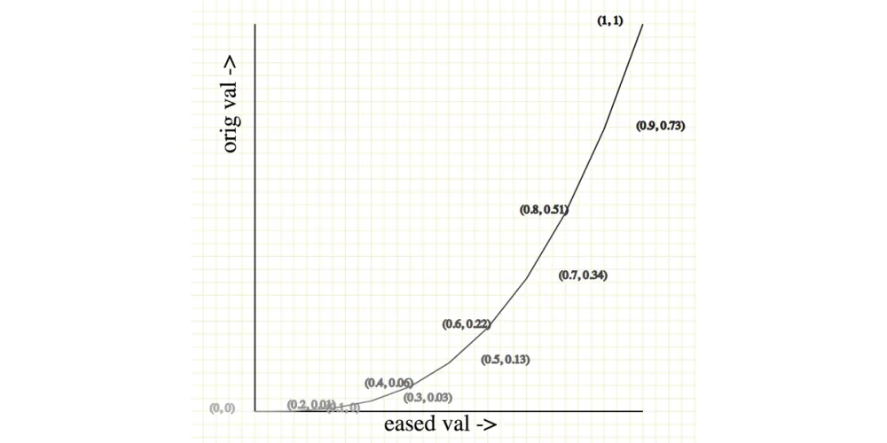
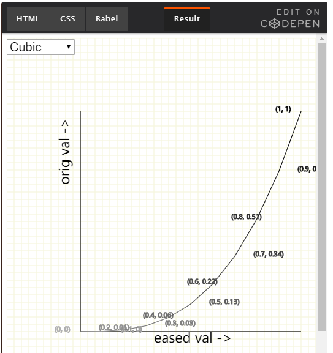
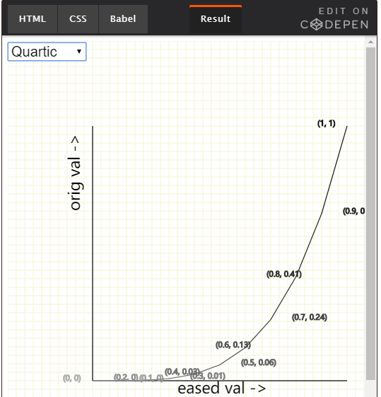
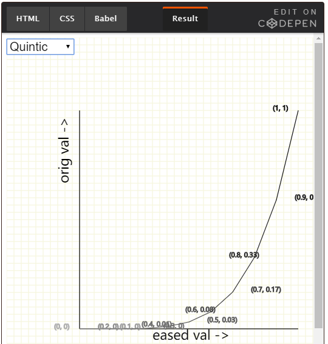
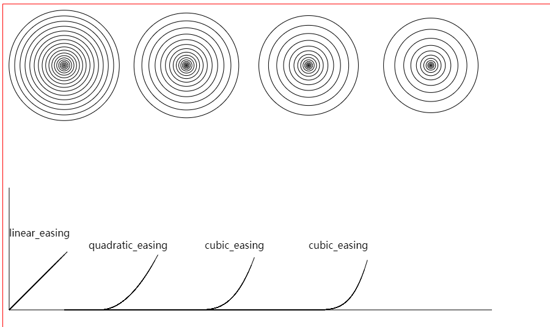

## 我如何进入缓和功能

我试图重新创造一种叫做*rotating snakes旋转蛇*的模式，这是一种视觉幻觉，它会欺骗大脑，让人们认为圆圈旋转，而不是“跳舞”。



我转向JavaScript使用canvas绘制一堆同心圆：
```
// 绘制同心圆
/***
 * arc(x, y, r, startAngle, endAngle, anticlockwise): 以(x, y)为圆心，以r为半径，
 * 从 startAngle弧度开始到endAngle弧度结束。anticlosewise是布尔值，true表示逆时针，false表示顺时针(默认是顺时针)。
 */
// 使用bezier-easing
for(let i = 0; i < 10; i++){
    ctx.beginPath()
    ctx.arc(100, 100, i * 10, 0, 2 * Math.PI, false)
    ctx.stroke()
}
```


嗯，还不是我想要的。实际上，这与模式的偏离更远。此外，这些代码难以定制，难以维护。

一个快速的谷歌搜索让我找到了这个要点，每个函数都有一个输入值，运行公式。并提供输出值。输入值必须介于*0和1*之间。（我们稍后会深入研究这个推理。）
二次缓和函数看起来很有前景，因为它所做的只是它接收的值的平方：
```
function (t) {
	return t * t
}
```

用easing画同心圆：
```
let easing = (t) => t * t
for(let i = 0; i < 1; i += 0.05){
    ctx.beginPath()
    ctx.arc(100, 100, easing(i) * 100, 0, 2 * Math.PI, false)
    ctx.stroke()
}
```


## What are easing functions? 什么是缓和功能？

它们是一种在0和1之间输入数字的函数。该数字遍历指定的函数，并返回0到1之间的另一个数字。【0-1之间的值乘以0-1之间的另一个值总会得到0-1之间的值。】这个特殊的属性帮助我们在保持在特定范围内的同时进行任何我们想要的计算。

缓变函数的目的是从线性值输入中得到非线性值。

这是我们需要知道的关于缓动函数的关键，他在这里的解释和演示都是为了让大家理解这个概念。

缓变函数是[插值概念](http://paulbourke.net/miscellaneous/interpolation/)在数学中的一种表现形式，插值是在曲线上找到一组点的过程，缓动函数本质上是通过插值(计算)不同的点集来绘制从0点到1点的曲线。

[Robert Penner在他的书中第一个定义了缓变函数，并为不同的函数创建了公式。](http://robertpenner.com/easing/penner_chapter7_tweening.pdf)

## The five types of easing functions 五种类型的缓动功能

有五种类型的缓和函数。它们可以混合、倒置，甚至混合在一起，形成附加的、更复杂的函数。让我们逐一研究一下。

### Linear easing functions 线性缓动功能

这是最基本的形式对于easing，如果我们在0和1之间插值的点之间的间隔是常数，然后我们形成一个线性easing function。

回到之前的同心圆的例子，将初始圆的半径增加一个常量(在本例中为10px)，就得到一个线性函数


毫无疑问，线性函数是默认的easing functions。它们非常简单，因为动画中没有曲线，对象以直线运动。方向一致。即便如此，线性函数有其缺点。例如，线性动画往往感觉不自然，甚至机器人，因为现实生活中的物体很少以这样完美的直线运动。

### Quadratic easing functions 二次缓动功能

Quadratic 英 /kwɒ'drætɪk/  美 /kwɑ'drætɪk/ adj. [数] 二次的 n. 二次方程式

二次easing function是通过将0和1之间的值乘以自身(例如0.5*0.5)来创建的。我们之前学过,我们看到这个结果的值也在0和1之间 (e.g. 0.5*0.5 = 0.25)(e.g例如)。为了演示，让我们用一个二次函数在0和1之间取10个值。

```
const quadratic_easing = (t) => t * t
let quadratic_values = []
for(let i = 0; i < 1; i += 0.1){
	quadratic_values.push(quadratic_easing(i))
}
```



如果我们把这个值画在以x轴为原始值，y轴为easing值的图上,我们会得到这样的结果：



注意些什么吗?曲线实际上与我们通常发现的简单函数相同，即使在CSS中也是如此!

### Cubic, Quartic and Quintic easing functions 三次、四次、五次easing function

Cubic 英 /'kjuːbɪk/  美 /'kjubɪk/ adj. 立方体的，立方的
Quartic 英 /'kwɔːtɪk/  美 /'kwɔrtɪk/ adj. 四次的 n. 四次方程；四次函数；四次曲线；四次曲面
Quintic 英 /'kwɪntɪk/ adj.（数学）五次方的；五次的

最后三种类型的easing函数表现相同，但是使用不同的值

三次easing function是通过将0到1之间的值乘以自身三次来创建的，换句话说，它是某个值(例如t)的立方(例如t3)。



四次函数也是一样，不过是4的幂函数。如果t是我们的值，我们看t4



正如你们已经猜到的，五次函数的幂是5。



### Easing in and easing out…or both!

"一种简单的食物是一种美味的半对半的组合，就像香草巧克力卷成的冰淇淋甜筒。"
————— Robert Penner(easing算法作者)

Ease in和Ease out可能是最熟悉的easing动画。他们经常通过在动画的开始或结束(或两者都)减速来平滑一条典型的直线。

Ease in和Ease out动画可以使用我们已经看到的任何非线性函数创建，虽然最常用的是三次函数，事实上，CSS动画属性随附Ease in和Ease out值开箱即用，通过animation-timing-function子属性

* ease-in: 这个函数开始时很慢，但结束时更快。
* ease-out: 这个函数开始快，结束慢。
* ease-in-out: 这个函数作为其他函数的组合，从快速开始，在中间减速，然后以更快的速度结束。

这些曲线也可以用JavaScript创建。我个人喜欢并使用bezier-easing库，[ Easing.js](https://gist.github.com/gre/1650294)是另一个很好的例子，[D3‘s](https://github.com/d3/d3-ease)库也是(Mike Bostock举了一个很好的例子)

### canvas绘制结果




