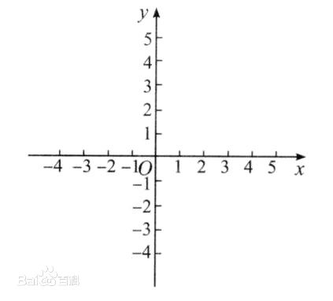
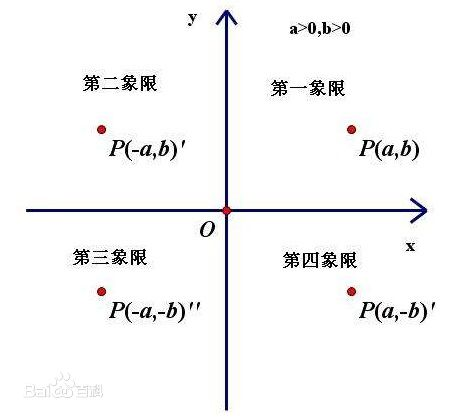
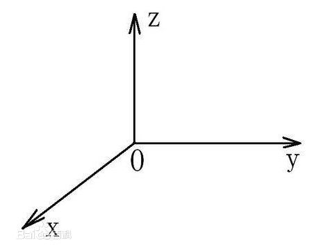
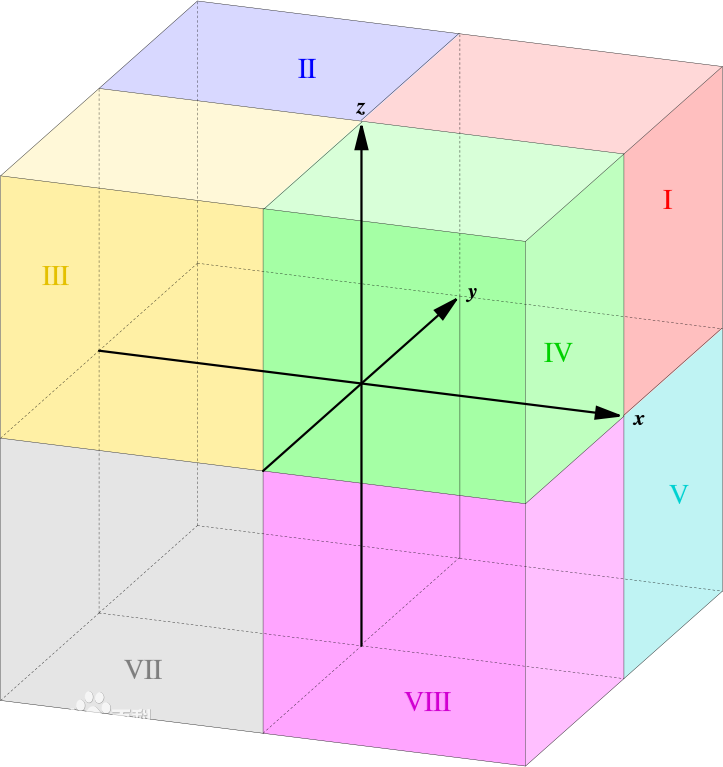
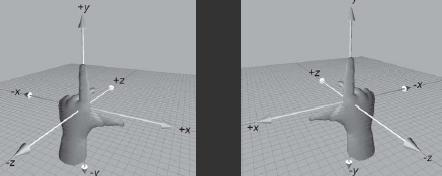

## 1.笛卡尔坐标系

笛卡尔坐标系（Cartesian coordinates，法语：les coordonnées cartésiennes）就是直角坐标系和斜坐标系的统称。

Cartesian 美 /kɑrˈtɪʒən/  adj. （与）笛卡尔极其思想（有关）的；笛卡尔哲学的 n. 笛卡尔主义者；笛卡尔教学与方法追随者；笛卡尔信徒
coordinates /kəu'ɔ:dineits/ 坐标系

相交于原点的两条数轴，构成了平面放射坐标系。如两条数轴上的度量单位相等，则称此放射坐标系为笛卡尔坐标系。两条数轴互相垂直的笛卡尔坐标系，称为**笛卡尔直角坐标系**，否则称为**笛卡尔斜角坐标系**。

二维的直角坐标系是由两条相互垂直、0 点重合的数轴构成的。在平面内，任何一点的坐标是根据数轴上对应的点的坐标设定的。在平面内，任何一点与坐标的对应关系，类似于数轴上点与坐标的对应关系。采用直角坐标，几何形状可以用代数公式明确的表达出来。几何形状的每一个点的直角坐标必须遵守这代数公式。

## 2.二维坐标系

二维的直角坐标系通常由两个互相垂直的坐标轴设定，通常分别称为 x-轴
和 y-轴；两个坐标轴的相交点，称为**原点**，通常标记为 O ，既有“零”的意思，又是英语“Origin”的首字母。每一个轴都指向一个特定的方向。这两个不同线的坐标轴，决定了一个平面，称为 **xy-平面**，又称为**笛卡尔平面**。通常两个坐标轴只要互相垂直，其指向何方对于分析问题是没有影响的，但习惯性地（见右图），x-轴被水平摆放，称为横轴，通常指向右方；y-轴被竖直摆放而称为纵轴，通常指向上方。两个坐标轴这样的位置关系，称为二维的**右手坐标系**，或右手系。如果把这个右手系画在一张透明纸片上，则在平面内无论怎样旋转它，所得到的都叫做右手系；但如果把纸片翻转，其背面看到的坐标系则称为**“左手系”**。这和照镜子时左右对掉的性质有关。

为了要知道坐标轴的任何一点，离原点的距离。假设，我们可以刻画数值于坐标轴。那么，从原点开始，往坐标轴所指的方向，每隔一个单位长度，就刻画数值于坐标轴。这数值是 刻画的次数，也是离原点的正值整数距离；同样地，背着坐标轴所指的方向，我们也可以刻画出 离原点的负值整数距离。称 x-轴刻画的数值为 x-坐标，又称横坐标，称 y-轴刻画的数值为 y-坐标，又称纵坐标。虽然，在这里，这两个坐标都是整数，对应于坐标轴特定的点。按照比例，我们可以推广至实数坐标 和其所对应的坐标轴的每一个点。这两个坐标就是直角坐标系的直角坐标，标记为**(x，y)**。

直角坐标系也可以推广至三维空间（3 dimension）与高维空间 (higher dimension) 。

直角坐标系的两个坐标轴将平面分成了四个部分，称为**象限**，分别用罗马数字编号为Ⅰ，Ⅱ，Ⅲ，Ⅳ。依照惯例，象限Ⅰ的两个坐标都是正值；象限Ⅱ的 x-坐标是负值， y-坐标是正值；象限Ⅲ的两个坐标都是负值的；象限Ⅳ的 x-坐标是正值， y-坐标是负值。所以，象限的编号是按照**逆时针方向**，从象限Ⅰ编到象限Ⅳ。

## 3.三维坐标系

放射坐标系和笛卡尔坐标系平面向空间的推广：相交于原点的三条不共面的数轴构成**空间的放射坐标系**。三条数轴上度量单位相等的放射坐标系被称为**空间笛卡尔坐标系**。三条数轴互相垂直的笛卡尔坐标系被称为**空间笛卡尔直角坐标系**，否则被称为**空间笛卡尔斜角坐标系**。

___
### （1.）空间直角坐标系

为了沟通空间图形与数的研究，我们需要建立空间的点与有序数组之间的联系，为此我们通过引进空间直角坐标系来实现。过定点O，作三条互相垂直的数轴，它们都以O为原点且一般具有相同的长度单位.这三条轴分别叫做x轴(横轴）、y轴(纵轴)、z轴(竖轴)；统称坐标轴.通常把x轴和y轴配置在水平面上，而z轴则是铅垂线。

在三维笛卡尔坐标系中，三个平面，xy-平面，yz-平面，xz-平面，将三维空间分成了八个部分，称为卦限(octant) 空。第Ⅰ卦限的每一个点的三个坐标都是正值。

octant 卦限 英 /'ɒkt(ə)nt/  美 /'ɑktənt/ n. [航][水运] 八分仪；[数] 八分圆；成45°视角的位置

___
### （2.）卦限

卦限，是数学中的一个基本概念。
在空间立体几何中，由相互垂直的坐标轴X轴、Y轴、Z轴，把整个空间划分成八个部分，其中每一部分称为一个卦限(Octant)。

空间任意选定一点O,过点O作三条互相垂直的数轴Ox，Oy，Oz，它们都以O为原点且具有相同的长度单位。这三条轴分别称作x轴（横轴），y轴（纵轴），z轴（竖轴），统称为坐标轴。

任意两条坐标轴确定一个平面，这样可确定三个互相垂直的平面，统称为坐标面。其中x轴与y轴所确定的坐标面称为xOy面，类似地有yOz面和zOx面。三个坐标面把空间分成八个部分，每一部分称为一个卦限。如右图所示，八个卦限分别用字母Ⅰ、Ⅱ、...、Ⅷ表示，其中含x轴、y轴和z轴正半轴的是**第Ⅰ卦限**，在xOy面上的其他三个卦限**按逆时针方向排定**，依次为第Ⅱ、Ⅲ、Ⅳ卦限；在xOy面下方与第Ⅰ卦限相邻的为第Ⅴ卦限，然后也按逆时针方向排定依次为第Ⅵ、Ⅶ、Ⅷ卦限。

卦限是笛卡儿坐标系中，象限在三维空间的对应术语，用于空间解析几何的坐标系统。空间直角坐标系用于确定空间的任意一点的位置。

因卦限相对象限较为罕见，世界各地的数学家乃至不同时间的数学印刷物都曾使用过不同的数序来标记各个卦限，所以为了避免混淆，可以采用另一种标记卦限的方式。**直接地，明确指出某卦限范围内包含的 x、y、z 坐标的正负，来标记那个卦限。**如图1中的第一卦限（I）标作“(+,+,+)”；第四卦限（IV）标作“(+,-,+)”；第八卦限（Ⅷ）标作“(+,-,-)”。

八个卦限在几何图中通常以罗马数字“I、II、III、IV、V、VI、VII、VIII”标示。较为普遍的卦限数序均以 x 轴正半轴、y 轴正半轴和 z 轴正半轴确定的卦限为“第一卦限”，罗马数字标记为“I”。第二、三、四卦限的数序类似平面直角坐标中象限的数序。在 xy 平面上向逆时针方向增加数序。而后第五至七卦限在 xy 平面下同样以逆时针方向标记。

___
### （3.）左手坐标系、右手坐标系

左手坐标系：伸出左手，让拇指和食指成“L”形，大拇指向右，食指向上，其余手指指向前方

右手坐标系：手坐标系，相同，只是把左手换成右手。如图2所示。

