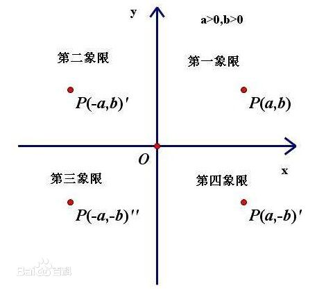
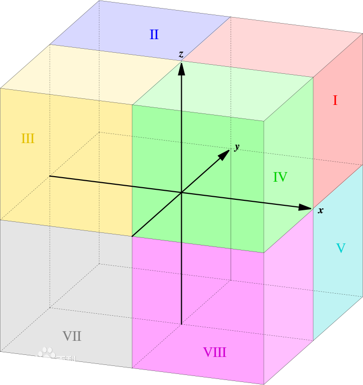
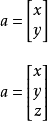
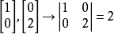
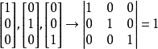
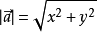
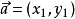
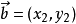
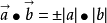
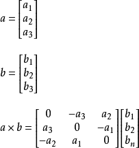

## 1.笛卡尔坐标系

笛卡尔坐标系（Cartesian coordinates，法语：les coordonnées cartésiennes）就是直角坐标系和斜坐标系的统称。

Cartesian 美 /kɑrˈtɪʒən/  adj. （与）笛卡尔极其思想（有关）的；笛卡尔哲学的 n. 笛卡尔主义者；笛卡尔教学与方法追随者；笛卡尔信徒
coordinates /kəu'ɔ:dineits/ 坐标系

相交于原点的两条数轴，构成了平面放射坐标系。如两条数轴上的度量单位相等，则称此放射坐标系为笛卡尔坐标系。两条数轴互相垂直的笛卡尔坐标系，称为**笛卡尔直角坐标系**，否则称为**笛卡尔斜角坐标系**。

二维的直角坐标系是由两条相互垂直、0 点重合的数轴构成的。在平面内，任何一点的坐标是根据数轴上对应的点的坐标设定的。在平面内，任何一点与坐标的对应关系，类似于数轴上点与坐标的对应关系。采用直角坐标，几何形状可以用代数公式明确的表达出来。几何形状的每一个点的直角坐标必须遵守这代数公式。

## 2.二维坐标系

二维的直角坐标系通常由两个互相垂直的坐标轴设定，通常分别称为 x-轴
和 y-轴；两个坐标轴的相交点，称为**原点**，通常标记为 O ，既有“零”的意思，又是英语“Origin”的首字母。每一个轴都指向一个特定的方向。这两个不同线的坐标轴，决定了一个平面，称为 **xy-平面**，又称为**笛卡尔平面**。通常两个坐标轴只要互相垂直，其指向何方对于分析问题是没有影响的，但习惯性地（见右图），x-轴被水平摆放，称为横轴，通常指向右方；y-轴被竖直摆放而称为纵轴，通常指向上方。两个坐标轴这样的位置关系，称为二维的**右手坐标系**，或右手系。如果把这个右手系画在一张透明纸片上，则在平面内无论怎样旋转它，所得到的都叫做右手系；但如果把纸片翻转，其背面看到的坐标系则称为**“左手系”**。这和照镜子时左右对掉的性质有关。

为了要知道坐标轴的任何一点，离原点的距离。假设，我们可以刻画数值于坐标轴。那么，从原点开始，往坐标轴所指的方向，每隔一个单位长度，就刻画数值于坐标轴。这数值是 刻画的次数，也是离原点的正值整数距离；同样地，背着坐标轴所指的方向，我们也可以刻画出 离原点的负值整数距离。称 x-轴刻画的数值为 x-坐标，又称横坐标，称 y-轴刻画的数值为 y-坐标，又称纵坐标。虽然，在这里，这两个坐标都是整数，对应于坐标轴特定的点。按照比例，我们可以推广至实数坐标 和其所对应的坐标轴的每一个点。这两个坐标就是直角坐标系的直角坐标，标记为**(x，y)**。

直角坐标系也可以推广至三维空间（3 dimension）与高维空间 (higher dimension) 。

直角坐标系的两个坐标轴将平面分成了四个部分，称为**象限**，分别用罗马数字编号为Ⅰ，Ⅱ，Ⅲ，Ⅳ。依照惯例，象限Ⅰ的两个坐标都是正值；象限Ⅱ的 x-坐标是负值， y-坐标是正值；象限Ⅲ的两个坐标都是负值的；象限Ⅳ的 x-坐标是正值， y-坐标是负值。所以，象限的编号是按照**逆时针方向**，从象限Ⅰ编到象限Ⅳ。

## 3.三维坐标系

放射坐标系和笛卡尔坐标系平面向空间的推广：相交于原点的三条不共面的数轴构成**空间的放射坐标系**。三条数轴上度量单位相等的放射坐标系被称为**空间笛卡尔坐标系**。三条数轴互相垂直的笛卡尔坐标系被称为**空间笛卡尔直角坐标系**，否则被称为**空间笛卡尔斜角坐标系**。

___
### （1.）空间直角坐标系

为了沟通空间图形与数的研究，我们需要建立空间的点与有序数组之间的联系，为此我们通过引进空间直角坐标系来实现。过定点O，作三条互相垂直的数轴，它们都以O为原点且一般具有相同的长度单位.这三条轴分别叫做x轴(横轴）、y轴(纵轴)、z轴(竖轴)；统称坐标轴.通常把x轴和y轴配置在水平面上，而z轴则是铅垂线。

在三维笛卡尔坐标系中，三个平面，xy-平面，yz-平面，xz-平面，将三维空间分成了八个部分，称为卦限(octant) 空。第Ⅰ卦限的每一个点的三个坐标都是正值。

octant 卦限 英 /'ɒkt(ə)nt/  美 /'ɑktənt/ n. [航][水运] 八分仪；[数] 八分圆；成45°视角的位置

___
### （2.）卦限

卦限，是数学中的一个基本概念。
在空间立体几何中，由相互垂直的坐标轴X轴、Y轴、Z轴，把整个空间划分成八个部分，其中每一部分称为一个卦限(Octant)。

空间任意选定一点O,过点O作三条互相垂直的数轴Ox，Oy，Oz，它们都以O为原点且具有相同的长度单位。这三条轴分别称作x轴（横轴），y轴（纵轴），z轴（竖轴），统称为坐标轴。

任意两条坐标轴确定一个平面，这样可确定三个互相垂直的平面，统称为坐标面。其中x轴与y轴所确定的坐标面称为xOy面，类似地有yOz面和zOx面。三个坐标面把空间分成八个部分，每一部分称为一个卦限。如右图所示，八个卦限分别用字母Ⅰ、Ⅱ、...、Ⅷ表示，其中含x轴、y轴和z轴正半轴的是**第Ⅰ卦限**，在xOy面上的其他三个卦限**按逆时针方向排定**，依次为第Ⅱ、Ⅲ、Ⅳ卦限；在xOy面下方与第Ⅰ卦限相邻的为第Ⅴ卦限，然后也按逆时针方向排定依次为第Ⅵ、Ⅶ、Ⅷ卦限。

卦限是笛卡儿坐标系中，象限在三维空间的对应术语，用于空间解析几何的坐标系统。空间直角坐标系用于确定空间的任意一点的位置。

因卦限相对象限较为罕见，世界各地的数学家乃至不同时间的数学印刷物都曾使用过不同的数序来标记各个卦限，所以为了避免混淆，可以采用另一种标记卦限的方式。**直接地，明确指出某卦限范围内包含的 x、y、z 坐标的正负，来标记那个卦限。**如图1中的第一卦限（I）标作“(+,+,+)”；第四卦限（IV）标作“(+,-,+)”；第八卦限（Ⅷ）标作“(+,-,-)”。

八个卦限在几何图中通常以罗马数字“I、II、III、IV、V、VI、VII、VIII”标示。较为普遍的卦限数序均以 x 轴正半轴、y 轴正半轴和 z 轴正半轴确定的卦限为“第一卦限”，罗马数字标记为“I”。第二、三、四卦限的数序类似平面直角坐标中象限的数序。在 xy 平面上向逆时针方向增加数序。而后第五至七卦限在 xy 平面下同样以逆时针方向标记。

___
### （3.）左手坐标系、右手坐标系

左手坐标系：伸出左手，让拇指和食指成“L”形，大拇指向右，食指向上，其余手指指向前方

右手坐标系：手坐标系，相同，只是把左手换成右手。如图2所示。

## 4.向量

在数学中，**向量**（也称为欧几里得向量、几何向量、矢量），指具有大小（magnitude）和方向的量。它可以形象化地表示为带箭头的线段。**箭头所指**：代表向量的方向；**线段长度**：代表向量的大小。与向量对应的量叫做**数量**（物理学中称**标量**），数量（或标量）只有大小，没有方向。

向量的记法：印刷体记作黑体（粗体）的字母（如a、b、u、v），书写时在字母顶上加一小箭头“→”。  如果给定向量的起点（A）和终点（B），**可将向量记作AB（并于顶上加→）**。在空间直角坐标系中，也能把向量以数对形式表示，**例如xOy平面中(2,3)是一向量**。

在物理学和工程学中，几何向量更常被称为矢量。许多物理量都是矢量，比如一个物体的位移，球撞向墙而对其施加的力等等。与之相对的是标量，即只有大小而没有方向的量。一些与向量有关的定义亦与物理概念有密切的联系，例如向量势对应于物理中的势能。

几何向量的概念在线性代数中经由抽象化，得到更一般的向量概念。此处向量定义为向量空间的元素，要注意这些抽象意义上的向量不一定以数对表示，大小和方向的概念亦不一定适用。因此，平日阅读时需按照语境来区分文中所说的"向量"是哪一种概念。不过，依然可以找出一个向量空间的基来设置坐标系，也可以透过选取恰当的定义，在向量空间上介定范数和内积，这允许我们把抽象意义上的向量类比为具体的几何向量。
___
### （1.）表达方式

###### 代数表示：

一般印刷用黑体的小写英文字母（a、b、c等）来表示，手写用在a、b、c等字母上加一箭头（→）表示，如  ，也可以用大写字母AB、CD上加一箭头（→）等表示。

___
###### 几何表示：

向量可以用有向线段来表示。有向线段的长度表示**向量的大小**，向量的大小，也就是向量的长度。长度为0的向量叫做**零向量**，记作长度等于1个单位的向量，叫做**单位向量**。

___
###### 坐标表示：

在**平面直角坐标系中**，分别取与x轴、y轴方向相同的**两个单位向量i**，**j作为一组基底**。a为平面直角坐标系内的任意向量，以坐标原点O为起点P为终点作**向量a**。由**平面向量基本定理**可知，有且只有一对实数（x,y），使得a=xi+yj，因此把实数对(x,y)叫做&**向量a的坐标**，记作a=(x,y)。这就是向量a的坐标表示。其中**(x,y)**就是点 的坐标。**向量a**称为点P的位置向量。

在**空间直角坐标系中**，分别取与x轴、y轴，z轴方向相同的3个**单位向量i，j，k**作为一组基底。若为该坐标系内的任意向量，以坐标原点O为起点作**向量a**。由空间基本定理知，有且只有一组实数(x,y,z)，使得a=ix+jy+kz，因此把实数对(x,y,z)叫做向量a的坐标，记作a=(x,y,z)。这就是向量a的坐标表示。其中**(x,y,z)**，就是点P的坐标。**向量a**称为点P的位置向量。

___
###### 向量的矩阵表示：

___
### （2.）行列式的几何意义

行列式的值是一个数字，表示向量所在空间的【元素】 大小。

比如，在平面直角坐标系中，整个平面可以由长宽均为1的方格构成，这个方格的大小为1。这个方格就是平面直角坐标系中的【元素】，大小为1。

为向量的矩阵表达方式

平面坐标系中所有的点都可以用这两个向量来刻画，这两个向量也叫平面直角坐标空间的【标度】。

这两向量构成的行列式那么，平面直角坐标系单元格大小，也就是【元素】大小为1的正方块。

再比如，我们对平面直角坐标系拉伸，用如下两个向量来刻画

那么，这个新坐标系（2维空间）的【元素】大小为2的长方块。

____
再比如，我们对平面直角坐标系变形，用如下两个向量来刻画

那么，这个新坐标系（2维空间）的【元素】大小为2的平行四边形块。

以上3个例子，可以看出来：在2维空间中，两个2维向量构成的的行列式的值，等同于两个向量组成的平行四边形面积大小。也就是说，在2维空间中，两个2维向量构成的的行列式的值，等同于两个2维向量的【叉积】。

___
进一步，看3维空间。

比如，在空间直角坐标系中，这个空间可以由长宽高均为1的正方体构成，这个正方体的大小为1。这个正方体就是空间直角坐标系（3维空间）中的【元素】，大小为1。

那么可以看出来：在3维空间中，三个3维向量构成的的行列式的值，等同于三个3维向量的【混合积】。

由此，扩展到n维空间。在n维空间中，n个n维向量构成的行列式的值，表示n维向量所在的n维空间的【元素】 大小。同时，这n个n维向量也叫n维空间的【标度】。

___
### (3.)相关定义

###### 有向线段

规定若线段的端点为起点，为终点，则线段就具有了从起点到终点的方向和长度。

具有方向和长度的线段叫做有向线段。

___
###### 向量的模

向量的大小，也就是向量的长度(或称**模**)。向量a的模记作**|a|**。

注：
* 1．向量的模是非负实数，向量的模是可以比较大小的。向量
* 2．因为方向不能比较大小，所以向量也就不能比较大小。对于向量来说“大于”和“小于”的概念是没有意义的。例如 是没有意义的。

___
###### 单位向量

长度为一个单位（即模为1）的向量，叫做**单位向量**。与a同向，且长度为单位1的向量，叫做**a方向上的单位向量**，记作

___
###### 负向量

如果向量AB与向量CD的模相等且方向相反，那么我们把向量AB叫做向量CD的负向量，也称为相反向量。

___
###### 零向量

长度为0的向量叫做零向量，记作0。零向量的始点和终点重合，所以零向量没有确定的方向，或说零向量的方向是任意的。

___
###### 相等向量

长度相等且方向相同的向量叫做相等向量．向量a与b相等，记作a=b。

规定：所有的零向量都相等。

当用有向线段表示向量时，起点可以任意选取。任意两个相等的非零向量，都可用同一条有向线段来表示，并且与有向线段的起点无关．同向且等长的有向线段都表示同一向量。

___
###### 自由向量

始点不固定的向量，它可以任意的平行移动，而且移动后的向量仍然代表原来的向量。

在自由向量的意义下，相等的向量都看作是同一个向量。

数学中只研究自由向量。

___
###### 滑动向量

沿着直线作用的向量称为滑动向量。

___
###### 固定向量

作用于一点的向量称为固定向量（亦称胶着向量）。

___
###### 位置向量

对于坐标平面内的任意一点P，我们把向量OP叫做点P的位置向量，记作：向量P。

___
###### 方向向量

直线l上的向量a以及与向量a共线的向量叫做直线l上的方向向量。

___
###### 相反向量

与a长度相等、方向相反的向量叫做a的相反向量，记作-a，有 -(-a)=a，零向量的相反向量仍是零向量。

___
###### 平行向量

方向相同或相反的非零向量叫做平行（或共线）向量．向量a、b平行（共线），记作**a//b**。零向量长度为零，是起点与终点重合的向量，其方向不确定。我们规定：零向量与任一向量平行。平行于同一直线的一组向量是共线向量。

若a=(x,y)，b=(m,n)，则a//b→a×b=xn-ym=0

___
###### 共面向量

平行于同一平面的三个（或多于三个）向量叫做共面向量。
空间中的向量有且只有以下两种位置关系：⑴共面；⑵不共面。
注意：只有三个或三个以上向量才谈共面不共面。

___
###### 法向量

直线l⊥α，取直线l的方向向量a，则向量a叫做平面α的**法向量**。

___
###### 向量的和的模

设平面直角坐标系xOy中，有点A(x1,y1)、B(x2,y2)，则

___
### (4.)向量运算

设，

###### 加法
 
向量的加法满足平行四边形法则和三角形法则，

向量加法的运算律：
* 交换律：a+b=b+a；
* 结合律：(a+b)+c=a+(b+c)。

___
###### 减法

如果a、b是互为相反的向量，那么a=-b，b=-a，a+b=0. 0的反向量为0。
OA-OB=BA.即“共同起点，指向被减”。
a=(x1,y1)，b=(x2,y2) ，则a-b=(x1-x2,y1-y2)。
如图：c=a-b 以b的结束为起点，a的结束为终点。
 

加减变换律：a+(-b)=a-b

___
###### 数乘

实数λ和向量a的叉乘乘积是一个向量，记作λa，且|λa|=|λ|*|a|。

当λ>0时，λa的方向与a的方向相同；当λ<0时，λa的方向与a的方向相反；当λ=0时，λa=0，方向任意。当a=0时，对于任意实数λ，都有λa=0。

注：按定义知，如果λa=0，那么λ=0或a=0。

实数λ叫做向量a的系数，乘数向量λa的几何意义就是将表示向量a的有向线段伸长或压缩。

当 |λ| >1时，表示向量a的有向线段在原方向（λ>0）或反方向（λ<0）上伸长为原来的|λ|倍

当|λ|<1时，表示向量a的有向线段在原方向（λ>0）或反方向（λ<0）上缩短为原来的 |λ|倍。

实数p和向量a的点乘乘积是一个数。

数与向量的乘法满足下面的运算律: 
* 结合律：(λa)·b=λ(a·b)=(a·λb)。
* 向量对于数的分配律（第一分配律）：(λ+μ)a=λa+μa.
* 数对于向量的分配律（第二分配律）：λ(a+b)=λa+λb.
* 数乘向量的消去律：① 如果实数λ≠0且λa=λb，那么a=b。② 如果a≠0且λa=μa，那么λ=μ。
* 需要注意的是：向量的加减乘（向量没有除法）运算满足实数加减乘运算法则。

___
###### 数量积

定义：已知两个非零向量a,b，作OA=a,OB=b，则∠AOB称作向量a和向量b的夹角，记作θ并规定0≤θ≤π

定义：两个向量的数量积（内积、点积）是一个**数量（没有方向）**，记作a·b。

数量积、内积、点积：在数学中，数量积（dot product; scalar product，也称为点积）是接受在实数R上的两个向量并返回一个实数值标量的二元运算。它是欧几里得空间的标准内积。

若a、b不共线，则；若a、b共线，则。

向量的**数量积**的坐标表示：a·b=x·x'+y·y'。

向量的数量积的运算律：
* a·b=b·a（交换律）
* (λa)·b=λ(a·b)(关于数乘法的结合律)
* （a+b)·c=a·c+b·c（分配律）

向量的数量积的性质：
* a·a=|a|的平方。
* a⊥b〈=〉a·b=0。
* |a·b|≤|a|·|b|。（该公式证明如下：|a·b|=|a|·|b|·|cosα| 因为0≤|cosα|≤1，所以|a·b|≤|a|·|b|）

向量的数量积与实数运算的主要不同点：
* 1．向量的数量积不满足结合律，即：(a·b)·c≠a·(b·c)；例如：(a·b)²≠a²·b²。
* 2．向量的数量积不满足消去律，即：由a·b=a·c(a≠0)，推不出b=c。
* 3．|a·b|与|a|·|b|不等价
* 4．由 |a|=|b| ，不能推出a=b，也不能推出a=-b，但反过来则成立。

___
###### 向量积

定义：两个向量a和b的向量积（外积、叉积）是一个向量，记作a×b（这里“×”并不是乘号，只是一种表示方法，与“·”不同，也可记做“∧”）。若a、b不共线，则**a×b的模(向量的长度)**是：∣a×b∣=|a|·|b|·sin〈a，b〉；a×b的方向是：垂直于a和b，且a、b和a×b按这个次序**构成右手系**。若a、b垂直，则∣a×b∣=|a|*|b|（此处与数量积不同，请注意），若a×b=0，则a、b平行。<b>向量积</b>即两个不共线非零向量所在平面的一组<b>法向量<b>。

运算法则：运用三阶行列式：
* 设a,b,c分别为沿x,y,z轴的单位向量
* A=(x1,y1,z1)，B=（x2,y2,z2），则
* 

向量的向量积性质：
* |a×b|是以a和b为边的平行四边形面积。
* a×a=0。
* a平行b〈=〉a×b=0

向量的向量积运算律：
* a×b=-b×a
* (λa)×b=λ(a×b)=a×(λb)
* a×(b+c)=a×b+a×c.
* (a+b)×c=a×c+b×c.

上两个分配律分别称为左分配律和右分配律。在演算中应注意不能交换“×”号两侧向量的次序。

注：向量没有除法，“向量AB/向量CD”是没有意义的。

___
###### 三向量混合积

定义：给定空间三向量a、b、c，向量a、b的向量积a×b，再和向量c作数量积(a×b)·c，所得的数叫做三向量a、b、c的混合积，记作(a,b,c)或(abc)，即**(abc)=(a,b,c)=(a×b)·c**

混合积具有下列性质：
* 1．三个不共面向量a、b、c的混合积的绝对值等于以a、b、c为棱的平行六面体的体积V，并且当a、b、c构成右手系时混合积是正数；当a、b、c构成左手系时，混合积是负数，即(abc)=εV（当a、b、c构成右手系时ε=1；当a、b、c构成左手系时ε=-1）
* 2．上性质的推论：三向量a、b、c共面的充要条件是(abc)=0
* 3．(abc)=(bca)=(cab)=-(bac)=-(cba)=-(acb)

___
###### 双重向量积

给定空间的三个向量a,b,c,如果先做其中两个向量a,b的向量积a×b，再做所得向量与第三向量的向量积，那么最后的结果仍然是一个向量，叫做所给三向量的双重向量积，记做：(a×b)×c。

性质：
* (a×b)×c=(a·c)·b-(b·c)·a
* a×(b×c)=-(b×c)×a=(a·c)·b-(a·b)·c

### (5.)λ

希腊字母表中排序第十一位的字母，英语名称为Lambda。

Lambda（大写Λ，小写λ）读音：lam (b) da（兰木达）['læmdə]

大写Λ用于：
* 粒子物理学上，Λ重子的符号

小写λ用于：
* 物理上的波长符号
* 放射学的衰变常数
* 线性代数中的特征值
* 西里尔字母的 Л 是由 Lambda 演变而成

### (6.)μ

μ是希腊字母，英语音标注音：/mju:/。
英文：mu。

## 5.矩阵
