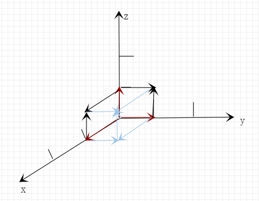
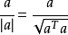
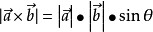

## 向量

在数学中，**向量**（也称为欧几里得向量、几何向量、矢量），指具有大小（magnitude）和方向的量。它可以形象化地表示为带箭头的线段。**箭头所指**：代表向量的方向；**线段长度**：代表向量的大小。与向量对应的量叫做**数量**（物理学中称**标量**），数量（或标量）只有大小，没有方向。

向量的记法：印刷体记作黑体（粗体）的字母（如a、b、u、v），书写时在字母顶上加一小箭头“→”。  如果给定向量的起点（A）和终点（B），**可将向量记作AB（并于顶上加→）**。在空间直角坐标系中，也能把向量以数对形式表示，**例如xOy平面中(2,3)是一向量**。

在物理学和工程学中，几何向量更常被称为矢量。许多物理量都是矢量，比如一个物体的位移，球撞向墙而对其施加的力等等。与之相对的是标量，即只有大小而没有方向的量。一些与向量有关的定义亦与物理概念有密切的联系，例如向量势对应于物理中的势能。

几何向量的概念在线性代数中经由抽象化，得到更一般的向量概念。此处向量定义为向量空间的元素，要注意这些抽象意义上的向量不一定以数对表示，大小和方向的概念亦不一定适用。因此，平日阅读时需按照语境来区分文中所说的"向量"是哪一种概念。不过，依然可以找出一个向量空间的基来设置坐标系，也可以透过选取恰当的定义，在向量空间上介定范数和内积，这允许我们把抽象意义上的向量类比为具体的几何向量。

## 1、表达方式

### 代数表示：

一般印刷用黑体的小写英文字母（a、b、c等）来表示，手写用在a、b、c等字母上加一箭头（→）表示，如  ，也可以用大写字母AB、CD上加一箭头（→）等表示。

### 几何表示：

向量可以用有向线段来表示。有向线段的长度表示**向量的大小**，向量的大小，也就是向量的长度。长度为0的向量叫做**零向量**，记作长度等于1个单位的向量，叫做**单位向量**。

### 坐标表示：

在**平面直角坐标系中**，分别取与x轴、y轴方向相同的**两个单位向量i**，**j作为一组基底**。a为平面直角坐标系内的任意向量，以坐标原点O为起点P为终点作**向量a**。由**平面向量基本定理**可知，有且只有一对实数（x,y），使得a=xi+yj，因此把实数对(x,y)叫做&**向量a的坐标**，记作a=(x,y)。这就是向量a的坐标表示。其中**(x,y)**就是点 的坐标。**向量a**称为点P的位置向量。

在**空间直角坐标系中**，分别取与x轴、y轴，z轴方向相同的3个**单位向量i，j，k**作为一组基底。若为该坐标系内的任意向量，以坐标原点O为起点作**向量a**。由空间基本定理知，有且只有一组实数(x,y,z)，使得a=ix+jy+kz，因此把实数对(x,y,z)叫做向量a的坐标，记作a=(x,y,z)。这就是向量a的坐标表示。其中**(x,y,z)**，就是点P的坐标。**向量a**称为点P的位置向量。

##### 向量的矩阵表示：

## 2、行列式的几何意义

行列式的值是一个数字，表示向量所在空间的【元素】 大小。

比如，在平面直角坐标系中，整个平面可以由长宽均为1的方格构成，这个方格的大小为1。这个方格就是平面直角坐标系中的【元素】，大小为1。

为向量的矩阵表达方式

平面坐标系中所有的点都可以用这两个向量来刻画，这两个向量也叫平面直角坐标空间的【标度】。

这两向量构成的行列式那么，平面直角坐标系单元格大小，也就是【元素】大小为1的正方块。

再比如，我们对平面直角坐标系拉伸，用如下两个向量来刻画

那么，这个新坐标系（2维空间）的【元素】大小为2的长方块。

____
再比如，我们对平面直角坐标系变形，用如下两个向量来刻画

那么，这个新坐标系（2维空间）的【元素】大小为2的平行四边形块。

以上3个例子，可以看出来：在2维空间中，两个2维向量构成的的行列式的值，等同于两个向量组成的平行四边形面积大小。也就是说，在2维空间中，两个2维向量构成的的行列式的值，等同于两个2维向量的【叉积】。

___
进一步，看3维空间。

比如，在空间直角坐标系中，这个空间可以由长宽高均为1的正方体构成，这个正方体的大小为1。这个正方体就是空间直角坐标系（3维空间）中的【元素】，大小为1。

那么可以看出来：在3维空间中，三个3维向量构成的的行列式的值，等同于三个3维向量的【混合积】。

由此，扩展到n维空间。在n维空间中，n个n维向量构成的行列式的值，表示n维向量所在的n维空间的【元素】 大小。同时，这n个n维向量也叫n维空间的【标度】。

## 3、相关定义

### 有向线段

规定若线段的端点为起点，为终点，则线段就具有了从起点到终点的方向和长度。

具有方向和长度的线段叫做有向线段。

### 向量的模 
向量的大小，也就是向量的长度(或称**模**)。向量a的模记作**|a|**。

注：
* 1．向量的模是非负实数，向量的模是可以比较大小的。向量
* 2．因为方向不能比较大小，所以向量也就不能比较大小。对于向量来说“大于”和“小于”的概念是没有意义的。例如 是没有意义的。

### 单位向量
长度为一个单位（即模为1）的向量，叫做**单位向量**。与a同向，且长度为单位1的向量，叫做**a方向上的单位向量**，记作

### 负向量
如果向量AB与向量CD的模相等且方向相反，那么我们把向量AB叫做向量CD的负向量，也称为相反向量。

### 零向量
长度为0的向量叫做零向量，记作0。零向量的始点和终点重合，所以零向量没有确定的方向，或说零向量的方向是任意的。

### 相等向量
长度相等且方向相同的向量叫做相等向量．向量a与b相等，记作a=b。

规定：所有的零向量都相等。

当用有向线段表示向量时，起点可以任意选取。任意两个相等的非零向量，都可用同一条有向线段来表示，并且与有向线段的起点无关．同向且等长的有向线段都表示同一向量。

### 自由向量

始点不固定的向量，它可以任意的平行移动，而且移动后的向量仍然代表原来的向量。

在自由向量的意义下，相等的向量都看作是同一个向量。

数学中只研究自由向量。

### 滑动向量

沿着直线作用的向量称为滑动向量。

### 固定向量

作用于一点的向量称为固定向量（亦称胶着向量）。

### 位置向量
对于坐标平面内的任意一点P，我们把向量OP叫做点P的位置向量，记作：向量P。

### 方向向量
直线l上的向量a以及与向量a共线的向量叫做直线l上的方向向量。

### 相反向量
与a长度相等、方向相反的向量叫做a的相反向量，记作-a，有 -(-a)=a，零向量的相反向量仍是零向量。

### 平行向量
方向相同或相反的非零向量叫做平行（或共线）向量．向量a、b平行（共线），记作**a//b**。零向量长度为零，是起点与终点重合的向量，其方向不确定。我们规定：零向量与任一向量平行。平行于同一直线的一组向量是共线向量。

### 共面向量
平行于同一平面的三个（或多于三个）向量叫做共面向量。
空间中的向量有且只有以下两种位置关系：⑴共面；⑵不共面。
注意：只有三个或三个以上向量才谈共面不共面。

### 法向量
直线l⊥α，取直线l的方向向量a，则向量a叫做平面α的**法向量**。

### 向量的和的模
设平面直角坐标系xOy中，有点A(x1,y1)、B(x2,y2)，则

## 4、向量运算

设，

### (1、)加法
 
向量的加法满足平行四边形法则和三角形法则，

向量加法的运算律：
* 交换律：a+b=b+a；
* 结合律：(a+b)+c=a+(b+c)。

### （2、）减法

如果a、b是互为相反的向量，那么a=-b，b=-a，a+b=0. 0的反向量为0。
OA-OB=BA.即“共同起点，指向被减”。
a=(x1,y1)，b=(x2,y2) ，则a-b=(x1-x2,y1-y2)。
如图：c=a-b 以b的结束为起点，a的结束为终点。
 

加减变换律：a+(-b)=a-b

### （3、）加法、减法法则

**三角形定则**
三角形定则解决向量加法的方法：将各个向量依次首尾顺次相接，结果为第一个向量的起点指向最后一个向量的终点。

**平行四边形定则**
平行四边形定则解决向量加法的方法：将两个向量平移至公共起点，以向量的两条边作平行四边形，结果为公共起点的对角线。

平行四边形定则解决向量减法的方法：将两个向量平移至公共起点，以向量的两条边作平行四边形，结果由减向量的终点指向被减向量的终点（平行四边形定则只适用于两个非零非共线向量的加减） [3]  。

**坐标系解法**
在直角坐标系里面，定义原点为向量的起点。两个向量和与差的坐标分别等于这两个向量相应坐标的和与差，若向量的表示为(x，y)形式：
A(X1，Y1) B(X2，Y2)，则A + B=（X1+X2，Y1+Y2），A - B=（X1-X2，Y1-Y2）

简单地讲：向量的加减就是向量对应分量的加减，类似于物理的**正交分解**。

### （4、）数乘（叉乘乘积|λa|=|λ|*|a|）（伸缩向量和调转方向）

实数λ和向量a的叉乘乘积是一个向量，记作λa，且|λa|=|λ|*|a|。
当λ>0时，λa的方向与a的方向相同；当λ<0时，λa的方向与a的方向相反；当λ=0时，λa=0，方向任意。当a=0时，对于任意实数λ，都有λa=0。

**数乘向量的定义**：从这个狭义的定义中抽象出来，我们得到**数乘向量的定义**：一个数m乘一个向量a，结果是一个向量ma，称为数乘向量的积，**其模是|m||a|**，当m>0时，ma与a同向，当m<0时，ma与a反向，当m=0时，0a=0。这个定义可以形象地理解为，**把向量a伸缩|m|倍，再由m的符号确定是否调向**。
注：按定义知，如果λa=0，那么λ=0或a=0。
特别地，当λ =-1时，记(-1)a =-a。

**几何意义**：实数λ叫做向量a的系数，乘数向量λa的几何意义就是将表示向量a的有向线段伸长或压缩。
* 当 |λ| >1时，表示向量a的有向线段在原方向（λ>0）或反方向（λ<0）上伸长为原来的|λ|倍
* 当|λ|<1时，表示向量a的有向线段在原方向（λ>0）或反方向（λ<0）上缩短为原来的 |λ|倍。
* 实数p和向量a的点乘乘积是一个数。

**数与向量的乘法满足下面的运算律**: 
* 结合律：(λa)·b=λ(a·b)=(a·λb)。
* 向量对于数的分配律（第一分配律）：(λ+μ)a=λa+μa.
* 数对于向量的分配律（第二分配律）：λ(a+b)=λa+λb.
* 数乘向量的消去律：① 如果实数λ≠0且λa=λb，那么a=b。② 如果a≠0且λa=μa，那么λ=μ。
* 需要注意的是：向量的加减乘（向量没有除法）运算满足实数加减乘运算法则。

**a单位化**：
由定义知λa与a是共线向量，任意非零向量a都可写作a=|a|a0（|a|是向量的模,可当做系数λ），或  。这说明非零向量a乘以它的模的倒数，便可得到与它同方向的单位向量a0，简称为把a单位化。

### （5、）数量积（内积、点积）

**定义**：已知两个非零向量a,b，作OA=a,OB=b，则∠AOB称作向量a和向量b的夹角，记作θ并规定0≤θ≤π
两个向量的数量积（内积、点积）是一个**数量（没有方向）**，记作a·b。

**数量积、内积、点积**：在数学中，数量积（dot product; scalar product，也称为点积）是接受在实数R上的两个向量并返回一个实数值标量的二元运算。它是欧几里得空间的标准内积。

**若a、b不共线，则；若a、b共线，则。**

**向量的数量积的坐标表示**：a·b=x·x'+y·y'。

**向量的数量积的运算律：**
* a·b=b·a（交换律）
* (λa)·b=λ(a·b)(关于数乘法的结合律)
* （a+b)·c=a·c+b·c（分配律）

**向量的数量积的性质：**
* a·a=|a|的平方。
* a⊥b〈=〉a·b=0。
* |a·b|≤|a|·|b|。（该公式证明如下：|a·b|=|a|·|b|·|cosα| 因为0≤|cosα|≤1，所以|a·b|≤|a|·|b|）

**向量的数量积与实数运算的主要不同点：**
* 1．向量的数量积不满足结合律，即：(a·b)·c≠a·(b·c)；例如：(a·b)²≠a²·b²。
* 2．向量的数量积不满足消去律，即：由a·b=a·c(a≠0)，推不出b=c。
* 3．|a·b|与|a|·|b|不等价
* 4．由 |a|=|b| ，不能推出a=b，也不能推出a=-b，但反过来则成立。

**向量的数量积几何意义**
①一个向量在另一个向量方向上的投影
* 设θ是a、b的夹角，则|b|cos（模b * cosθ）叫做向量b在向量a的方向上的投影，|a|cosθ（模a * cosθ）叫做向量a在向量b方向上的投 影。

②a·b的几何意义
* 数量积a·b等于a的长度|a|（模a）与b在a的方向上的投影|b|cosθ的乘积

### （6、）向量积（外积、叉积）（法向量）∣a×b∣=|a|·|b|·sin〈a，b〉

**定义**：
（1、）两个向量a和b的向量积（外积、叉积）是一个向量，记作a×b（这里“×”并不是乘号，只是一种表示方法，与“·”不同，也可记做“∧”）。
* 若a、b不共线，则**a×b的模(向量的长度)**是：∣a×b∣=|a|·|b|·sin〈a，b〉；a×b的方向是：垂直于a和b，且a、b和a×b按这个次序**构成右手系**。
* 若a、b垂直，则∣a×b∣=|a|*|b|（此处与数量积不同，请注意），若a×b=0，则a、b平行。
* <b>向量积</b>即两个不共线非零向量所在平面的一组<b>法向量</b>。
* 而c的方向垂直于a与b所决定的平面，c的指向按右手定则从a转向b来确定。
* 运算结果c是一个伪向量。这是因为在不同的坐标系中c可能不同。

（2、）向量积可以被定义为：
* **模长**：（在这里θ表示两向量之间的夹角（共起点的前提下）（0°≤θ≤180°），它位于这两个矢量所定义的平面上。）

* 方向：a向量与b向量的向量积的方向与这两个向量所在平面垂直，且遵守右手定则。（一个简单的确定满足“右手定则”的结果向量的方向的方法是这样的：若坐标系是满足右手定则的，当右手的四指从a以不超过180度的转角转向b时，竖起的大拇指指向是c的方向。）

**坐标运算**：
* 设a=（x, y, z），b=（x, y, z）。i，j，k分别是X，Y，Z轴方向的单位向量，则：
* a×b=（-）i+（-）j+（-）k，为了帮助记忆，利用三阶行列式，写成det 
* 

**坐标运算证明**：

了更好地推导，我们需要加入三个轴对齐的单位向量i，j，k。

**运算法则：运用三阶行列式**：
* 设a,b,c分别为沿x,y,z轴的单位向量
* A=(x1,y1,z1)，B=（x2,y2,z2），则
* 

**向量的向量积性质：**
* |a×b|是以a和b为边的平行四边形面积。
* a×a=0。
* a平行b〈=〉a×b=0

**向量的向量积运算律：**
* a×b=-b×a
* (λa)×b=λ(a×b)=a×(λb)
* a×(b+c)=a×b+a×c.
* (a+b)×c=a×c+b×c.

上两个分配律分别称为左分配律和右分配律。在演算中应注意不能交换“×”号两侧向量的次序。

注：向量没有除法，“向量AB/向量CD”是没有意义的。

### （7、）三向量混合积

定义：给定空间三向量a、b、c，向量a、b的向量积a×b，再和向量c作数量积(a×b)·c，所得的数叫做三向量a、b、c的混合积，记作(a,b,c)或(abc)，即(abc)=(a,b,c)=(a×b)·c

混合积具有下列性质：
* 1．三个不共面向量a、b、c的混合积的绝对值等于以a、b、c为棱的平行六面体的体积V，并且当a、b、c构成右手系时混合积是正数；当a、b、c构成左手系时，混合积是负数，即(abc)=εV（当a、b、c构成右手系时ε=1；当a、b、c构成左手系时ε=-1）
* 2．上性质的推论：三向量a、b、c共面的充要条件是(abc)=0
* 3．(abc)=(bca)=(cab)=-(bac)=-(cba)=-(acb)

### （8、）双重向量积

给定空间的三个向量a,b,c,如果先做其中两个向量a,b的向量积a×b，再做所得向量与第三向量的向量积，那么最后的结果仍然是一个向量，叫做所给三向量的双重向量积，记做：(a×b)×c。

性质：
* (a×b)×c=(a·c)·b-(b·c)·a
* a×(b×c)=-(b×c)×a=(a·c)·b-(a·b)·c

## 5、λ

希腊字母表中排序第十一位的字母，英语名称为Lambda。

Lambda（大写Λ，小写λ）读音：lam (b) da（兰木达）['læmdə]

大写Λ用于：
* 粒子物理学上，Λ重子的符号

小写λ用于：
* 物理上的波长符号
* 放射学的衰变常数
* 线性代数中的特征值
* 西里尔字母的 Л 是由 Lambda 演变而成

## 6、μ

μ是希腊字母，英语音标注音：/mju:/。
英文：mu。

## (7.)ε

美式英语中使用的一个音标，即 bed 的 e 音。

## 8、投影

投影 （tóuyǐng），数学术语，指图形的影子投到一个面或一条线上。

**定义** ： 

令投射线通过点或其他物体，向选定的投影面投射，并在该面上得到图形的方法称为投影法。

投影法分为中心投影法和平行投影法。

工程中常用的投影图有：多面正投影图、轴测投影图、标高投影图、透视投影图。其中多面正投影图是工程中最常用、最重要的投影图。

**应用**：

* 几何

从初中数学的角度来说，一般地，用光线照射物体，在某个平面（地面、墙壁等）上得到的影子叫做物体的**投影（Projection）**，照射光线叫做**投影线**，投影所在的平面叫做**投影面**。

有时光线是一组互相平行的射线，例如太阳光或探照灯光的一束光中的光线。由平行光线形成的投影是**平行投影（Parallel projection)**.由同一点（点光源发出的光线）形成的投影叫做**中心投影（Center projection)**。投影线垂直于投影面产生的投影叫做**正投影**。投影线不垂直于投影面产生的投影叫做**斜投影**。**物体投影的形状、大小与它相对于投影面的位置和角度有关。**

* 向量

设两个非零向量a与b的夹角为θ，则将**|b|·cosθ **叫做向量b在向量a方向上的**投影或称标投影（scalar projection）**。

在式中引入a的**单位矢量a（A）**，可以定义b在a上的**矢投影（vector projection）**

由定义可知，一个向量在另一个向量方向上的投影是一个数量。当θ为锐角时，它是正值；当θ为直角时，它是0；当θ为钝角时，它是负值；当θ=0°时，它等于|b|；当θ=180°时，它等于-|b|。

设单位向量e是直线m的方向向量，向量AB=a，作点A在直线m上的射影A'，作点B在直线m上的射影B'，则向量A'B' 叫做AB在直线m上或在向量e方向上的正射影，简称**射影**。

向量A'B'的模 |A'B'|=|AB|·|cos〈a，e〉|=|a·e|。

