## 矩阵

在数学中，矩阵（Matrix）是一个按照长方阵列排列的复数或实数集合 [1]  ，最早来自于方程组的系数及常数所构成的方阵。这一概念由19世纪英国数学家凯利首先提出。

Matrix 英 /'meɪtrɪks/  美 /ˈmeɪtrɪks/ n. [数] 矩阵；模型；[生物][地质] 基质；母体；子宫；[地质] 脉石 复数 matrices或matrixes

矩阵是高等代数学中的常见工具，也常见于统计分析等应用数学学科中。在物理学中，矩阵于电路学、力学、光学和量子物理中都有应用；计算机科学中，三维动画制作也需要用到矩阵。 矩阵的运算是数值分析领域的重要问题。将矩阵分解为简单矩阵的组合可以在理论和实际应用上简化矩阵的运算。对一些应用广泛而形式特殊的矩阵，例如稀疏矩阵和准对角矩阵，有特定的快速运算算法。关于矩阵相关理论的发展和应用，请参考**《矩阵理论》**。在天体物理、量子力学等领域，也会出现无穷维的矩阵，是矩阵的一种推广。

数值分析的主要分支致力于开发矩阵计算的有效算法，这是一个几个世纪以来的课题，是一个不断扩大的研究领域。 矩阵分解方法简化了理论和实际的计算。 针对特定矩阵结构（如稀疏矩阵和近角矩阵）定制的算法在有限元方法和其他计算中加快了计算。 无限矩阵发生在行星理论和原子理论中。 无限矩阵的一个简单例子是代表一个函数的**泰勒级数**的导数算子的矩阵

___
### 1、定义

由 m × n 个数aij排成的m行n列的数表称为m行n列的矩阵，简称m × n矩阵。记作：
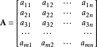

这m×n 个数称为矩阵A的元素，简称为元，数aij位于矩阵A的第i行第j列，称为矩阵A的(i,j)元，以数**aij为(i,j)元的矩阵可记为(aij)或(aij)m × n**，**m×n矩阵A也记作Amn**。

元素是实数的矩阵称为**实矩阵**，元素是复数的矩阵称为**复矩阵**。而行数与列数都等于n的矩阵称为**n阶矩阵**或**n阶方阵**

___
### 2、基本运算

矩阵运算在科学计算中非常重要，而矩阵的基本运算包括矩阵的加法，减法，数乘，转置，共轭和共轭转置。

#### 加法

矩阵的加法满足下列运算律(A，B，C都是同型矩阵)：

应该注意的是只有同型矩阵之间才可以进行加法。

#### 减法

#### 数乘

矩阵的数乘满足以下运算律：
* 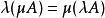
* 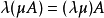
* 
* 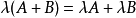

矩阵的加减法和矩阵的数乘合称矩阵的线性运算

#### 转置(相当于顺时针旋转90度)
把矩阵A的行和列互相交换所产生的矩阵称为A的转置矩阵（ 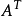 ），这一过程称为矩阵的转置

矩阵的转置满足以下运算律：
* 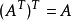
* 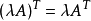
* 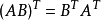

#### 共轭
矩阵的共轭定义为: 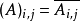。一个2×2**复数**矩阵的共轭（实部不变，虚部取负）如下所：

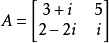

则

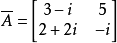

#### 共轭转置
矩阵的共轭转置定义为：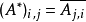 ，也可以写为：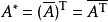或者写为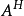。一个2×2复数矩阵的共轭转置如下所示：

则

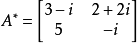

___
### 3、乘法（A列乘于B行）

两个矩阵的乘法仅当第一个矩阵A的列数和另一个矩阵B的行数相等时才能定义。如A是m×n矩阵和B是n×p矩阵，它们的乘积C是一个m×p矩阵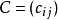，它的一个元素：
* 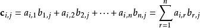

并将此乘积记为: 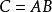

例如：

* 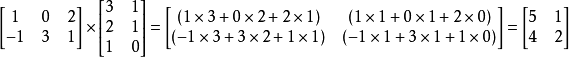

矩阵的乘法满足以下运算律：
* 结合律： 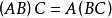
* 左分配律： 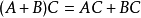
* 右分配律： 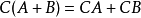
* 矩阵乘法不满足交换律。

___
### 4、行列式

一个n×n的正方矩阵A的行列式记为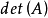或者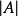, 一个2×2矩阵的行列式可表示如下：
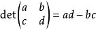

一个n×n矩阵的行列式等于其任意行（或列）的元素与对应的**代数余子式乘积之和**，即：
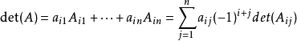

___
### 5、特征值与特征向量

n×n的方块矩阵A的一个特征值和对应特征向量是满足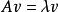的标量以及非零向量。其中**v为特征向量**，**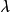为特征值**。

A的所有特征值的全体，叫做A的谱 ，记为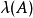。矩阵的特征值和特征向量可以揭示线性变换的深层特性。

___
### 6、矩阵的迹

矩阵A的对角元素之和称为矩阵A的**迹(trace)**,记作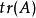, 即
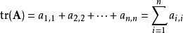

___
### 7.矩阵的逆

 

矩阵与矩阵的逆相乘得到单位矩阵：

