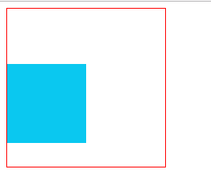

## createImageData()

### 定义和用法

* createImageData() 方法创建新的`空白 ImageData 对象`。新对象的默认像素值 transparent black。

* 对于 ImageData 对象中的每个像素，都存在着四方面的信息，即 RGBA 值：
>* R - 红色 (0-255)
>* G - 绿色 (0-255)
>* B - 蓝色 (0-255)
>* A - alpha 通道 (0-255; 0 是透明的，255 是完全可见的)

* 因此 ，transparent black 表示 (0,0,0,0)。

* olor/alpha 以数组形式存在，并且既然数组包含了每个像素的四条信息，数组的大小是 ImageData 对象的四倍。（获得数组大小有更简单的办法，就是使用 ImageDataObject.data.length）

* 包含 color/alpha 信息的数组存储于 ImageData 对象的 data 属性中。

* 提示：在操作完成数组中的 color/alpha 信息之后，您可以使用 putImageData() 方法将图像数据拷贝回画布上。


### 语法

* 1. 以指定的尺寸（以像素计）创建新的 ImageData 对象：
```
var imgData=context.createImageData(width,height)
```

* 2. 创建与指定的另一个 ImageData 对象尺寸相同的新 ImageData 对象（不会复制图像数据）：
```
var imgData=context.createImageData(imageData)
```

### 参数值

* width: ImageData 对象的宽度，以像素计。
* height: ImageData 对象的高度，以像素计。
* imageData: 另一个 ImageData 对象。

### 实例

* 使用 getImageData() 来反转画布上的图像的每个像素的颜色。

dirty 英 /'dɜːtɪ/  美 /ˈdɝ​tɪ/ adj. 下流的，卑鄙的；肮脏的；恶劣的；暗淡的 vt. 弄脏 vi. 变脏

```
<canvas id='canvas' width="200" height="200" style="border: solid 1px #f00;"></canvas>
<script tyoe='text/javascript'>
window.onload=function() {
	// 全局常量定义
	const canvas = document.getElementById('canvas')
	const ctx = canvas.getContext('2d')
	const canvasW = canvas.width // 必须canvas定义属性width
	const canvasH = canvas.height // 必须canvas定义属性height
	
	let imgData = ctx.createImageData(100, 100)
	console.log(imgData)
	for(let i = 0; i<= imgData.data.length; i += 4) {
		console.log(i)
		console.log(imgData)
		imgData.data[i + 0] = 10
		imgData.data[i + 1] = 200
		imgData.data[i + 2] = 240
		imgData.data[i + 3] = 255
	}
	ctx.putImageData(imgData, 0, 70)
}
</script>
```
