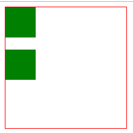

## putImageData()

### 定义和用法

* putImageData() 方法将图像数据（从指定的 ImageData 对象）放回画布上。

### 语法

```
context.putImageData(imgData,x,y,dirtyX,dirtyY,dirtyWidth,dirtyHeight)
```

### 参数值

* imgDara: 规定要放回画布的 ImageData 对象。
* x: ImageData 对象左上角的 x 坐标，以像素计。
* y: ImageData 对象左上角的 y 坐标，以像素计。
* dityX: 可选。水平值（x），以像素计，在画布上放置图像的位置。
* dityY: 可选。水平值（y），以像素计，在画布上放置图像的位置。
* dityWidth: 可选。在画布上绘制图像所使用的宽度。
* dityHeight: 可选。在画布上绘制图像所使用的高度。

### 实例

* 使用 getImageData() 来反转画布上的图像的每个像素的颜色。

dirty 英 /'dɜːtɪ/  美 /ˈdɝ​tɪ/ adj. 下流的，卑鄙的；肮脏的；恶劣的；暗淡的 vt. 弄脏 vi. 变脏

```
<canvas id='canvas' width="200" height="200" style="border: solid 1px #f00;"></canvas>
<script tyoe='text/javascript'>
window.onload=function() {
	// 全局常量定义
	const canvas = document.getElementById('canvas')
	const ctx = canvas.getContext('2d')
	const canvasW = canvas.width // 必须canvas定义属性width
	const canvasH = canvas.height // 必须canvas定义属性height
	
	ctx.fillStyle="green"
	ctx.fillRect(0,0,50,50)

	let imgData = ctx.getImageData(0, 0, 50, 50)
	ctx.putImageData(imgData, 0, 70)
}
</script>
```
